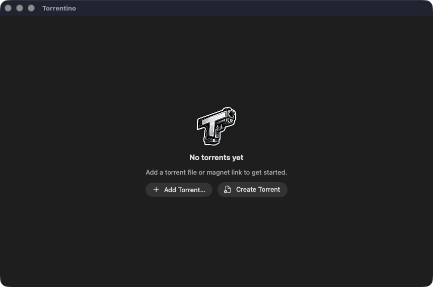
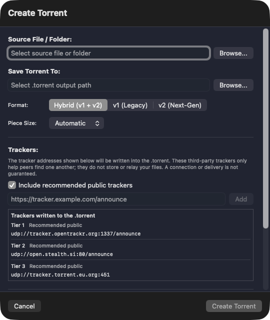

<p align="center">
  
</p>

<h1 align="center">Torrentino</h1>

<p align="center"><strong>A fast, native BitTorrent client for Apple Silicon Macs.</strong></p>

<p align="center">
  <a href="https://github.com/Pavan-Gopa/Torrentino/releases/latest"><strong>Download the latest release</strong></a>
</p>

<p align="center">
  <a href="https://github.com/Pavan-Gopa/Torrentino/releases/latest"></a>
  <a href="https://github.com/Pavan-Gopa/Torrentino/releases"></a>
  
  
  
  
  
  
  <a href="LICENSE"></a>
</p>

Torrentino pairs a native SwiftUI/AppKit interface with libtorrent in an isolated per-user engine. It keeps everyday torrent controls direct while preserving durable state and a clear recovery boundary between the app and transfer process.

## What it does

- Add `.torrent` files, `.torrent` URLs, or magnet links, select individual files, and pause or resume transfers.
- Create v1, v2, or hybrid torrents from files and folders.
- Create torrents from Finder with the **Create with Torrentino** service, and open downloaded content in Finder.
- Use **Remove** to keep downloaded files; after confirmation, **Remove and Delete Files** moves downloaded data to Trash while protecting files shared by other torrents.
- Keep the interface and transfer engine isolated through Mach XPC, with state stored in SQLite WAL mode.

## Gallery

<table>
  <tr>
    <td width="58%" valign="top">
      
    </td>
    <td width="42%" valign="top">
      
    </td>
  </tr>
  <tr>
    <td align="center"><sub>Start by adding a torrent or opening Creator.</sub></td>
    <td align="center"><sub>Create v1, v2, or hybrid torrents.</sub></td>
  </tr>
</table>

## Requirements

- macOS 13 Ventura or newer
- Apple Silicon (`arm64`)
- Network and file or folder access when requested by macOS for the workflow you choose

## Install

1. Download the latest `.dmg` from [Releases](https://github.com/Pavan-Gopa/Torrentino/releases/latest).
2. Open the disk image.
3. Drag **Torrentino** to **Applications**.
4. Launch Torrentino normally from Applications.

Release `v1.0.0` is signed with a Developer ID certificate, notarized by Apple, and stapled. No `xattr` command, Gatekeeper bypass, or security workaround should be needed. Do not bypass Gatekeeper to install Torrentino.

## Security and updates

Torrentino uses an EdDSA-signed Sparkle feed. Updates run only when you choose **Check for Updates**; there is no automatic background update polling.

The app intentionally uses a Developer ID distribution architecture without App Sandbox. Its libtorrent engine runs as an unprivileged, per-user LaunchAgent rather than a system daemon.

## Architecture

```text
Torrentino app (SwiftUI / AppKit)
                ⇅  Mach XPC
Per-user LaunchAgent (libtorrent 2.1.1)
                ⇅
          SQLite (WAL)
```

The app owns presentation and user actions; the LaunchAgent owns transfer work and durable torrent state. This boundary lets the engine recover independently without privileged system services.

## Building from source

Source builds are intended for advanced contributors and are not presented as a one-command dependency install. Start with the pinned native dependency versions in [`Native/ThirdParty/versions.lock`](Native/ThirdParty/versions.lock), then use the [`Torrentino native macOS implementation plan`](TORRENTINO_NATIVE_MACOS_IMPLEMENTATION_PLAN.md) for build layout and implementation context.

## Responsible use

Torrentino is a general-purpose BitTorrent client. Download and share only material you are legally permitted to use and distribute, and follow the laws that apply where you live.

## License

Torrentino is available under the [MIT License](LICENSE).
