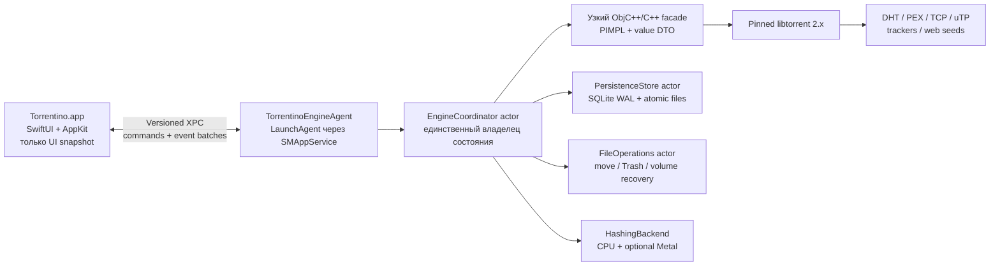
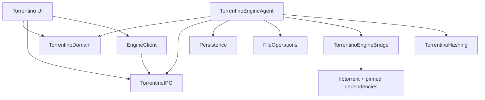

# Torrentino Native macOS — авторитетный план реализации

> Полный handoff-документ для модели/агента, который будет реализовывать проект.
>
> **Статус:** утверждённая техническая и продуктовая база, версия 1.0
>
> **Дата аудита:** 2026-08-01
>
> **Целевая платформа:** macOS 13+, только Apple Silicon (`arm64`)
>
> **Главный критерий:** стабильность и сохранность данных, затем скорость и функциональность
>
> **Текущий `PLAN.md`:** исторический документ старого Tauri/Rust-направления; для native-направления не является источником истины

---

## 0. Как пользоваться этим документом

Этот файл предназначен не для обсуждения идеи, а для последовательной реализации другим AI-агентом. Исполнитель должен:

1. Прочитать этот документ полностью до изменения кода.
2. Прочитать действующие `AGENTS.md`, README и проектные конфиги.
3. Выполнять work packages строго по порядку и не перескакивать через stop-gates.
4. Считать каждый пакет отдельной проверяемой поставкой с тестами и evidence.
5. Не менять старый Tauri-код «заодно».
6. Не удалять legacy-версию до отдельного решения владельца проекта.
7. Не называть продукт стабильным до полного 168-часового soak test.
8. Не обещать использование Metal, пока оно не прошло correctness/performance gate.
9. Никогда не скрывать CPU fallback и не жертвовать стабильностью ради GPU.
10. Не объявлять этап завершённым по одному факту успешной сборки.

### 0.1. Что считается источником истины

Порядок приоритетов:

1. Сохранность пользовательских данных.
2. Контракты macOS и используемых зависимостей из первичных источников.
3. Воспроизводимое поведение проверенной release-сборки.
4. Автоматические тесты и сохранённые evidence-артефакты.
5. Этот план и принятые в нём ADR как зафиксированный intent.
6. Старые README/`PLAN.md`/комментарии в прототипе.

Если реализация требует отступить от решения этого документа:

- остановить текущий gate, если наблюдение противоречит ADR;
- создать короткий ADR с причиной, альтернативами и последствиями;
- получить подтверждение владельца для фундаментальной развилки;
- не прятать изменение внутри обычного коммита;
- обновить этот документ или добавить связанный decision record.

Нельзя игнорировать подтверждённое поведение платформы ради буквального
выполнения устаревшего пункта плана.

### 0.2. Запрещённые короткие пути

- Нельзя считать Tauri WebView нативным SwiftUI/AppKit UI.
- Нельзя писать собственный BitTorrent-протокол на Swift.
- Нельзя напрямую экспортировать `libtorrent`, Boost или C++ ownership в Swift/UI.
- Нельзя держать UI и торрент-сессию в одном процессе.
- Нельзя использовать числовой session-local ID как долговременный product ID.
- Нельзя восстанавливать задачи только сканированием папки загрузок.
- Нельзя делать `remove(deleteFiles: Bool)` без двухфазного manifest-based удаления.
- Нельзя использовать бесконечные очереди, unlimited connections/cache по умолчанию.
- Нельзя обновлять весь список через polling и полную перерисовку.
- Нельзя молча создавать папку на месте исчезнувшего внешнего диска.
- Нельзя зависеть от `/opt/homebrew`, `/usr/local` или установленного у пользователя Homebrew.
- Нельзя форкать `libtorrent` ради Metal без отдельного нового решения владельца.
- Нельзя распространять ad-hoc signed app/DMG как production.

---

## 1. Итоговое решение

### 1.1. Переписывать ли проект

**Да.** Для заявленной цели — простой, быстрый и максимально надёжный клиент только для Apple Silicon — разумно создать новый native macOS target.

Но переписывание должно быть не «Tauri на Swift», а сменой системной архитектуры:

- **SwiftUI + AppKit** для настоящего macOS-интерфейса;
- **`libtorrent 2.x`** как зрелое BitTorrent-ядро;
- **отдельный пользовательский engine-agent**, которым управляет `launchd`;
- **версионированный XPC-контракт** между UI и движком;
- **SQLite WAL + атомарные resume/metainfo checkpoints**;
- **ограниченные очереди и ресурсы**;
- **fault-injection и длительный soak test** до релиза;
- **Metal только адаптивно**, где измерена реальная выгода и гарантирован CPU fallback.

Swift выбран ради native lifecycle, UI, macOS-интеграции и безопасной concurrency-модели. Сам по себе язык не предотвращает зависания движка, потерю resume-state или ошибочное удаление файлов.

### 1.2. Краткая целевая схема



### 1.3. Что будет означать «стабильный»

Слово «стабильный» допустимо только после доказательства:

- UI не теряет состояние при падении/перезапуске engine-agent;
- engine-agent продолжает работу при закрытии окна и переживает падение UI;
- после `SIGKILL`, sleep/wake, network flap и restart восстанавливаются все записи;
- partial data не перезаписываются и не обнуляются;
- повреждённый resume изолируется, а не рушит всю сессию;
- пропавший volume затрагивает только связанные задачи;
- disk full не создаёт crash/busy-loop;
- удаление не может выйти за точный manifest;
- нет монотонного роста RAM, threads, file descriptors или XPC connections;
- пройден полный 168-часовой тестовый прогон.

---

## 2. Product North Star

### 2.1. Основная формулировка

Torrentino — нативный, локальный, минималистичный BitTorrent-клиент для Apple Silicon, который сохраняет задачи и данные предсказуемо, не блокирует интерфейс из-за сети/диска/hashing и изолирует сбой одной задачи или движка от всего приложения.

Терминологически это **torrent client**, а не централизованный tracker server.
Он умеет создавать metainfo, указывать announce tracker tiers и становиться
первоначальным seeder. Собственный сетевой tracker server в 1.0 не входит.

Для неприватных `.torrent`, создаваемых в Creator, Torrentino по умолчанию
включает release-curated tiers сторонних публичных announce trackers с видимым
opt-out до inspect/create. Это стандартный BitTorrent best-effort: tracker
выполняет только rendezvous, не хранит и не relay-ит payload; Torrentino не
управляет этим сервисом и не гарантирует соединение или доставку. Private
Creator никогда не получает эти public defaults.

### 2.2. Порядок приоритетов

1. **Сохранность данных.**
2. **Отсутствие crash/hang и восстановление после сбоя.**
3. **Предсказуемый контроль ресурсов.**
4. **Высокая реальная скорость.**
5. **Полнота повседневных функций.**
6. **Минималистичный native UX.**
7. **Оптимизации Metal, если они доказаны.**

Если оптимизация ухудшает первые три пункта, она отклоняется.

### 2.3. Целевой пользовательский результат

Пользователь должен иметь возможность:

- добавить magnet, `.torrent` или URL;
- до старта проверить torrent, выбрать файлы и папку;
- закрыть окно и не бояться за активные передачи;
- перезапустить UI или движок без потери списка;
- увидеть точное состояние каждой задачи;
- pause/resume/recheck/move/remove без неоднозначности;
- никогда не удалить payload случайной кнопкой;
- создать v1/v2/hybrid `.torrent` и начать его сидировать;
- получить локальный диагностический отчёт без утечки приватных данных.

### 2.4. Не-цели первой production-версии

- Intel Mac и другие платформы.
- Pure Swift BitTorrent engine.
- App Store distribution и App Sandbox.
- Встроенный публичный tracker server.
- Torrentino-operated managed seed/relay/WebSeed/availability service и
  гарантия доставки произвольному получателю.
- Torrent search/index или каталог контента.
- RSS, remote Web UI/API, streaming player.
- Плагины и расширяемая экосистема.
- Telemetry, аккаунт, облачная синхронизация.
- «Максимум соединений любой ценой».
- Metal для DHT, trackers, TCP/uTP, disk scheduling или UI.
- Обязательное использование Metal на каждой операции.

---

## 3. Подтверждённый аудит текущего проекта

### 3.1. Снимок репозитория на 2026-08-01

- Ветка: `master`.
- Единственный commit: `899c691` — `snapshot: user baseline before fixes`.
- Git remote отсутствует.
- `src-tauri/src/gui.rs` содержит **379 незакоммиченных строк**.
- Рабочее дерево нельзя очищать, reset-ить или переписывать.
- Репозиторий занимает около 4.2 GiB почти полностью из-за `src-tauri/target`.
- Текущий стек: Tauri 2 + Rust + `librqbit 8.1.1` + HTML/CSS/JavaScript.
- Автоматических тестов, CI, lint-конфигурации и release evidence нет.

### 3.2. Текущая сборка не проходит

Проверенная команда:

```bash
cd src-tauri
cargo check --locked --offline --message-format=short
```

Результат: 8 compile errors:

| Место | Подтверждённая проблема |
|---|---|
| `src-tauri/src/gui.rs:340` | используется не подключённый crate/module `tracing` |
| `src-tauri/src/gui.rs:199-200` | мутация `seen` и `out` внутри `Fn` closure |
| `src-tauri/src/gui.rs:216` | вызов private `ManagedTorrent.pause()` |
| `src-tauri/src/gui.rs:228` | вызов private `ManagedTorrent.start()` |
| `src-tauri/src/gui.rs:254` | у handle нет `with_files()` |
| `src-tauri/src/gui.rs:279` | вызов private `update_only_files()` |
| `src-tauri/src/gui.rs:295` | неверная сигнатура dialog API: `set_directory(true)` |

Следствие: сообщения предыдущего агента «почти готово» не соответствуют состоянию исходников.

### 3.3. Архитектурные дефекты legacy-реализации

| Область | Факт | Риск |
|---|---|---|
| Process isolation | `AppState` прямо держит `Arc<Session>` в Tauri-процессе (`gui.rs:58-63`) | падение backend завершает UI и передачи |
| Persistence | в `engine.rs:10-27` задан `fastresume`, но не задан `SessionOptions.persistence` | список задач не восстанавливается |
| Async safety | `blocking_lock()` вызывается из путей async-команд (`gui.rs:78-82`, `133-137`) | runtime panic |
| Startup/shutdown | Tauri заканчивает `.expect(...)` (`gui.rs:377-378`), release использует `panic = "abort"` | аварийное завершение вместо recovery |
| API boundary | UI-команды напрямую используют низкоуровневые `Session`/`ManagedTorrent` | хрупкость при API drift |
| Identity | наружу отдаётся session-local `usize` | ID нестабилен после восстановления |
| UI updates | `ui/app.js:93-112,225-227` каждые 700 ms получает весь список и строит DOM заново | overlapping calls, stale state, потеря focus/scroll |
| Errors | часть ошибок через `alert()`, часть только console, часть игнорируется | пользователь не понимает фактическое состояние |
| Folder choice | выбранная папка хранится только в памяти | настройка теряется |
| File selection | выбор происходит после запуска и по одному checkbox-запросу | гонки и плохой preflight |
| Safe removal | UI всегда вызывает `deleteFiles: false`, ясного UX нет | неполный продуктовый контракт |
| Creator | UI/engine flow отсутствует | обязательная функция не реализована |
| Watch folder | поля есть только в config | функциональность отсутствует |

### 3.4. Дополнительные несоответствия документации

- README заявляет automatic resume через `overwrite = true`, а текущий код задаёт `overwrite: false`.
- README называет Tauri WebView «native GUI», хотя UI — HTML/CSS/JS в WKWebView.
- README утверждает фактическую стабильность, которая не подтверждена тестами.
- `fastresume=true` ошибочно описан как полноценное восстановление сессии.
- Текущий `PLAN.md` выбирает библиотеку, но не проектирует fault isolation, durable state или безопасные файловые операции.

### 3.5. Текущий `.app`/DMG не является production-релизом

Проверенный старый artifact:

- `src-tauri/target/release/bundle/macos/Torrentino.app`;
- `src-tauri/target/release/bundle/dmg/Torrentino_0.1.0_aarch64.dmg`.

Факты:

- бинарник действительно thin `arm64`;
- подпись только `adhoc,linker-signed`;
- `TeamIdentifier=not set`;
- `Info.plist` не связан с code signature;
- `LSMinimumSystemVersion=10.13`;
- Mach-O `LC_BUILD_VERSION` требует `minos 11.0`;
- DMG не имеет доказанного Developer ID/notarization/stapling/Gatekeeper chain.

Этот `.app` допустим только как локальный legacy-прототип. Его нельзя:

- выдавать за свежую сборку текущих исходников;
- использовать как доказательство компиляции dirty `gui.rs`;
- распространять как production;
- брать за эталон minOS, signing или packaging.

### 3.6. Что можно сохранить

Сохраняются:

- имя и базовая идея Torrentino;
- продуктовая простота;
- часть defaults как исходные данные для migration;
- иконка только после визуальной проверки качества;
- легальные тестовые payloads, если они появятся;
- legacy-код как историческая/сравнительная реализация.

Не переносится один в один:

- HTML/CSS/JS UI;
- polling-модель;
- `AppState`;
- session-local IDs;
- прямые команды к `librqbit`;
- конфигурационная модель без транзакционного store;
- release pipeline.

### 3.7. Обязательная защита legacy

До нового кода исполнитель обязан:

1. Зафиксировать текущий dirty state отдельным checkpoint commit без исправлений.
2. Создать backup tag/branch.
3. Добавить/создать GitHub remote с участием владельца, если remote по-прежнему отсутствует.
4. Отправить backup off-site.
5. Создать отдельную рабочую ветку `codex/native-macos`.
6. Не перемещать старые файлы в первом native-коммите.

Старый target можно переместить в `Legacy/Tauri/` только:

- отдельным механическим коммитом;
- после native feature parity;
- после migration test;
- после зелёного soak gate;
- с явного согласия владельца.

---

## 4. Зафиксированные архитектурные решения

### ADR-001 — только Apple Silicon и macOS 13+

**Решение**

- Архитектура: только `arm64`.
- Deployment target: macOS 13.0 или выше.
- Intel/universal binary не создаётся.

**Причина**

- `SMAppService` даёт современную регистрацию Login Item/LaunchAgent на macOS 13+.
- Уменьшается матрица релизных вариантов.
- Можно опираться на современный Swift Concurrency.
- Metal и unified memory доступны в ожидаемой конфигурации Apple Silicon.

**Gate**

Все Mach-O, bundle plist и helper targets обязаны заявлять одинаковый minimum macOS.

### ADR-002 — SwiftUI + AppKit, без WebView

**Решение**

- SwiftUI: app composition, sheets, settings, inspector, state binding.
- AppKit: центральная таблица, menu commands, drag-and-drop, Finder integration и точное window behavior.
- Центральный список по умолчанию строится на `NSTableView`.

**Причина**

`NSTableView` даёт зрелую virtualization, multi-selection, column resizing/reordering и keyboard navigation. SwiftUI `Table` допустим только после доказательного benchmark на 100–500 строках без потери focus/selection.

### ADR-003 — `libtorrent 2.x` как production engine

**Решение**

- Использовать последнюю проверенную stable-версию ветки `2.x`.
- На момент аудита stable reference — `2.0.12`; `2.1.0-rc1` является pre-release и не должен автоматически попадать в production.
- Зафиксировать tag, commit SHA и SHA-256 исходного архива.
- Сборка self-contained, без runtime Homebrew dependencies.

**Причина**

`libtorrent` — зрелая feature-complete C++ библиотека с v1/v2/hybrid, DHT, PEX, uTP, web seeds, IPv6, fast resume и torrent creation.

**Не допускается**

- Использовать Homebrew dylib в release.
- Автоматически обновлять minor/patch без полного regression suite.
- Экспортировать Boost/libtorrent types из adapter.
- Использовать pre-release без отдельного ADR.

### ADR-004 — отдельный `TorrentinoEngineAgent`

**Решение**

- UI: `Torrentino.app`.
- Движок: bundled непривилегированный `TorrentinoEngineAgent`.
- Регистрация: `SMAppService.agent(plistName:)`.
- Коммуникация: Mach XPC service.
- Владелец libtorrent session, persistence и file operations — только agent.

**Причина**

Обычный embedded XPC service связан с жизнью клиента. LaunchAgent позволяет:

- продолжать передачи после закрытия окна/падения UI;
- перезапускать agent через `launchd`;
- иметь один durable owner состояния;
- не давать сбою UI повредить engine.

**Обязательный spike**

Поведение `RunAtLoad`, `KeepAlive`, user approval, crash restart, logout/login и update должно быть доказано на подписанной сборке и чистом macOS-пользователе. Debug-поведение Xcode не является доказательством.

WP-02 не может получить `PASS`, пока не зафиксированы:

- точный bundle layout;
- plist filename;
- LaunchAgent `Label`;
- `MachServices` name;
- `BundleProgram`;
- restart throttle;
- exit-code policy;
- idle/no-work exit policy;
- user-disabled behavior;
- logout/reboot semantics;
- bounded termination acknowledgement.

Статический `KeepAlive=true` нельзя принимать по умолчанию: он может мешать
штатному stop. Итоговая plist-policy выбирается только по результатам signed
spike. Если пользователь отклонил Login Item/agent, запрещён скрытый in-process
fallback: UI остаётся в ясном non-operational/degraded state.

Для `⌘Q` UI использует AppKit termination deferral
(`applicationShouldTerminate` + последующий reply), ждёт bounded checkpoint
acknowledgement и только затем завершает app/agent согласно §8.5.

**Запрет**

Никакого root helper, `LaunchDaemon` или `SMJobBless`.

### ADR-005 — узкий Objective-C++/C++ facade

**Решение**

```text
TorrentinoEngineAgent (Swift)
    → EngineCoordinator actor
        → LibtorrentAdapter (Objective-C++ facade)
            → TorrentinoEngineCore (C++ / libtorrent)
```

Facade обязан:

- использовать PIMPL;
- ловить все C++ exceptions до выхода в Swift;
- возвращать immutable value DTO или `EngineError`;
- скрывать `torrent_handle`, `session`, alerts, Boost-типы и указатели;
- отдавать агрегированные alert batches;
- не вызывать Swift по событию каждого peer/piece;
- иметь явную ownership-модель и deterministic shutdown.

Пример логической поверхности:

```cpp
class EngineBridge final {
public:
    Result<BootReport> start(const SessionConfiguration&);
    Result<AddResult> add(const AddSpecification&);
    Result<void> pause(const TorrentRecordID&);
    Result<void> resume(const TorrentRecordID&);
    Result<void> requestRecheck(const TorrentRecordID&);
    Result<void> moveStorage(const MoveStorageRequest&);
    Result<RemovalResult> commitRemoval(const RemovalToken&);
    std::vector<EngineAlertDTO> drainAlerts(std::size_t maxCount);
    Result<ResumeDataDTO> requestResumeData(const TorrentRecordID&);
    Result<SessionStateDTO> saveSessionState();
    HealthDTO health() const noexcept;
    void shutdown() noexcept;
private:
    struct Impl;
    std::unique_ptr<Impl> impl_;
};
```

### ADR-006 — версионированный XPC через Codable `Data`

**Решение**

Objective-C-compatible XPC protocol остаётся маленьким:

```swift
@objc protocol TorrentinoEngineXPCProtocol {
    func perform(
        _ request: Data,
        withReply: @escaping (Data?, NSError?) -> Void
    )

    func fetchSnapshot(
        _ request: Data,
        withReply: @escaping (Data?, NSError?) -> Void
    )

    func health(
        _ reply: @escaping (Data?, NSError?) -> Void
    )
}

@objc protocol TorrentinoEngineClientXPCProtocol {
    func receiveEventBatch(_ data: Data)
}
```

Payload кодируется как versioned envelope:

```swift
struct ProtocolEnvelope<Payload: Codable & Sendable>: Codable, Sendable {
    let protocolVersion: UInt16
    let engineInstanceID: UUID?
    let requestID: UUID
    let idempotencyKey: UUID?
    let sentAt: Date
    let payload: Payload
}
```

Правила:

- `stateRevision: UInt64` монотонен внутри `engineInstanceID`.
- Смена instance ID требует полного snapshot.
- Разрыв revision требует reconciliation.
- Mutating retry использует тот же `idempotencyKey`.
- Agent хранит bounded журнал recent commands.
- Payload имеет size limit, decode deadline и schema validation.
- Несовместимая версия даёт контролируемую ошибку.
- Speed/progress delta можно coalesce/drop.
- Ни одно transient event не является единственным источником correctness.
- Agent хранит bounded delta window, а authoritative truth остаётся в store.
- Add/remove/error/operation-complete не coalesce внутри доступного окна.
- Если cursor клиента старше oldest available revision, agent отправляет
  `snapshotRequired`, а UI выполняет полную reconciliation.
- Terminal operation result восстанавливается по `requestID`/`idempotencyKey`.

### ADR-007 — durable store: SQLite WAL + атомарные поколения файлов

**Решение**

- Только agent открывает store.
- SQLite: WAL, foreign keys, busy timeout, versioned migrations.
- Resume/metainfo/session state хранятся как атомарно сменяемые generation files с checksum.
- Перед schema migration создаётся consistent backup через SQLite backup API
  или `VACUUM INTO`, а не копированием открытого main-файла.
- При corruption все connections закрываются, а `sqlite3`, `-wal` и `-shm`
  сохраняются как единая forensic group.
- Открытую SQLite БД нельзя rename/move.
- Исходные данные не перезаписываются пустой БД.

### ADR-008 — direct distribution, Hardened Runtime, без App Sandbox в v1

**Решение**

- Distribution: Developer ID вне Mac App Store.
- Hardened Runtime обязателен для app и каждого executable helper.
- App Sandbox не включается в первой версии.
- Agent работает от текущего пользователя, без privilege elevation.

**Причина**

BitTorrent-клиенту нужны:

- входящие и исходящие network connections;
- DHT/UDP;
- произвольные пользовательские download locations;
- долгоживущий helper;
- внешние volumes.

App Sandbox можно исследовать после 1.0 отдельным ADR. Отсутствие sandbox не отменяет строгую проверку входных данных, XPC peers и путей.

### ADR-009 — Metal только как опциональный `HashingBackend`

**Решение**

```swift
protocol HashingBackend: Sendable {
    func hash(_ request: HashingRequest) async throws -> HashingResult
}

enum HashingMode: Codable, Sendable {
    case automatic
    case cpu
    case metal
}
```

- CPU backend всегда присутствует.
- Default для пользователя: `Automatic`.
- Metal сначала исследуется только для large batch hashing при создании torrent.
- Recheck допускается только при наличии чистой поддерживаемой точки интеграции.
- Live piece verification остаётся в libtorrent, если Metal требует deep fork.
- Любая Metal-ошибка приводит к полному безопасному пересчёту affected unit на CPU.

### ADR-010 — никаких необратимых удалений в 1.0

**Решение**

```swift
enum RemovalMode: Codable, Sendable {
    case keepData
    case moveManagedFilesToTrash
}
```

Permanent delete отсутствует. Любое удаление данных:

1. проходит `prepareRemoval`;
2. показывает точный manifest, root и размер;
3. получает одноразовый token;
4. повторно валидируется при `commitRemoval`;
5. перемещает только managed files в Trash;
6. не удаляет запись, если файловая операция не удалась.

---

## 5. Модули и структура репозитория

### 5.1. Рекомендуемая структура

Старые файлы остаются на месте до отдельного migration commit. Новый target создаётся отдельно:

```text
Torrentino/
├── TORRENTINO_NATIVE_MACOS_IMPLEMENTATION_PLAN.md
├── PLAN.md                          # legacy history
├── README.md                        # пока legacy, позднее общий entrypoint
├── Native/
│   ├── Torrentino.xcodeproj
│   ├── Config/
│   │   ├── Debug.xcconfig
│   │   ├── Release.xcconfig
│   │   ├── ExportOptions-DeveloperID.plist
│   │   └── Entitlements/
│   ├── TorrentinoApp/
│   │   ├── App/
│   │   ├── Domain/
│   │   ├── EngineClient/
│   │   ├── Features/
│   │   ├── UI/
│   │   ├── Resources/
│   │   └── Diagnostics/
│   ├── TorrentinoEngineAgent/
│   │   ├── Agent/
│   │   ├── EngineCoordinator/
│   │   ├── Persistence/
│   │   ├── FileOperations/
│   │   ├── Recovery/
│   │   └── Diagnostics/
│   ├── TorrentinoEngineBridge/
│   │   ├── include/
│   │   ├── ObjCxx/
│   │   └── Cpp/
│   ├── TorrentinoIPC/
│   ├── TorrentinoDomain/
│   ├── TorrentinoHashing/
│   │   ├── CPU/
│   │   ├── Metal/
│   │   └── Shaders/
│   ├── ThirdParty/
│   │   ├── manifests/
│   │   ├── patches/
│   │   └── licenses/
│   └── Tests/
│       ├── Domain/
│       ├── Persistence/
│       ├── Engine/
│       ├── Bridge/
│       ├── Integration/
│       ├── UI/
│       ├── Fault/
│       ├── Metal/
│       └── Benchmarks/
├── scripts/
│   ├── build-dependencies.sh
│   ├── verify-release.sh
│   ├── package-dmg.sh
│   └── collect-release-evidence.sh
└── artifacts/                       # ignored; manifest structure documented
```

### 5.2. Project generation

Для первой версии использовать обычный committed Xcode project. Не добавлять XcodeGen/Tuist только ради генерации проекта. Новая тяжёлая build dependency требует отдельного обоснования.

### 5.3. Target list

| Target | Назначение |
|---|---|
| `Torrentino` | UI app |
| `TorrentinoEngineAgent` | LaunchAgent + XPC listener |
| `TorrentinoDomain` | value types, state machines, errors |
| `TorrentinoIPC` | versioned envelopes, request/response/event schemas |
| `TorrentinoEngineBridge` | ObjC++/C++ facade над libtorrent |
| `TorrentinoHashing` | CPU и experimental Metal backends |
| Test targets | isolated unit/integration/fault/UI/benchmark suites |

### 5.4. Dependency direction



Запрещённые зависимости:

- UI → bridge/libtorrent/SQLite;
- bridge → UI;
- persistence → UI;
- Metal → libtorrent internals;
- legacy Tauri → native modules.

---

## 6. Concurrency и ownership

### 6.1. Единственные владельцы

| Слой | Владелец |
|---|---|
| UI snapshot, selection, window state | `@MainActor AppStore` |
| XPC connection/reconnect | `EngineClient actor` |
| Registry, revisions, desired states | `EngineCoordinator actor` |
| libtorrent session/handles | `LibtorrentAdapter` |
| SQLite | `PersistenceStore actor` |
| move/Trash/recheck serialization | `FileOperations actor` |
| hashing operations | `HashingScheduler actor` |

### 6.2. Неподвижные правила

- Swift 6 strict concurrency: `Complete` с первого пакета.
- Никаких disk/network/DB/hash operations на `MainActor`.
- XPC callback немедленно переводится в `EngineClient actor`.
- C++ pointer не пересекает actor boundary.
- DTO immutable и `Sendable`.
- Alert drain bounded и выполняется независимо от UI.
- Durable mutation считается completed только после persistence commit.
- UI не является источником истины.
- Необратимые optimistic updates запрещены.
- Cancellation имеет явные безопасные точки.
- Timeouts не означают, что mutating command не был выполнен; нужен idempotency lookup.

---

## 7. Доменные контракты

### 7.1. Идентичность

```swift
struct TorrentRecordID: RawRepresentable, Codable, Hashable, Sendable {
    let rawValue: UUID
}

struct ContentIdentity: Codable, Hashable, Sendable {
    let infoHashV1: Data?
    let infoHashV2: Data?
}
```

Правила:

- UI создаёт только `requestID`, `idempotencyKey` и `AddOperationID`.
- `TorrentRecordID` создаёт authoritative agent внутри durable
  `commitAdd` transaction и возвращает вместе с commit result.
- Повтор `commitAdd` с тем же idempotency key возвращает тот же record ID.
- v1/v2 hashes имеют unique indexes, когда известны.
- Hybrid torrent хранит оба hash.
- Magnet до metadata использует `AddOperationID`.
- Duplicate определяется по content identity, не имени/пути.
- Session-local handle ID никогда не уходит в UI/persistence.

### 7.2. Разделённое состояние

```swift
enum DesiredTorrentState: String, Codable, Sendable {
    case running
    case paused
    case removed
}

enum TorrentActivity: String, Codable, Sendable {
    case pendingAdd
    case fetchingMetadata
    case queued
    case checking
    case downloading
    case seeding
    case moving
    case removing
    case idle
}

enum TorrentHealth: Codable, Sendable {
    case healthy
    case waitingForNetwork
    case waitingForVolume
    case waitingForSpace
    case permissionDenied
    case recoverableError(EngineErrorCode)
    case fatalError(EngineErrorCode)
}
```

Разделение desired/activity/health предотвращает один огромный противоречивый enum.

### 7.3. Snapshot

```swift
struct TorrentSnapshot: Codable, Sendable, Identifiable {
    let id: TorrentRecordID
    let contentIdentity: ContentIdentity?
    let displayName: String
    let desiredState: DesiredTorrentState
    let activity: TorrentActivity
    let health: TorrentHealth
    let progress: TransferProgress
    let rates: TransferRates
    let peers: PeerSummary
    let saveLocation: PersistedLocation
    let revision: UInt64
}
```

Snapshot не содержит peer-level массивы и file tree целиком. Они запрашиваются paginated/on-demand.

### 7.4. Команды XPC v1

- `hello(clientVersion:supportedProtocolRange:)`
- `fetchSnapshot(afterRevision:)`
- `fetchFiles(recordID:cursor:pageSize:expectedRevision:)`
- `fetchPeers(recordID:cursor:pageSize:peerSnapshotToken:)`
- `fetchTrackers(recordID:cursor:pageSize:expectedRevision:)`
- `fetchActivity(recordID:cursor:pageSize:expectedRevision:)`
- `fetchRemovalManifestPage(token:cursor:pageSize:)`
- `fetchCreatorManifestPage(token:cursor:pageSize:)`
- `inspectAddSource`
- `commitAdd`
- `cancelAdd`
- `pause`
- `resume`
- `setFileSelection` — только `skip | normal` в 1.0
- `setLimits`
- `fetchSettings`
- `validateSettings`
- `applySettings(expectedRevision:)`
- `testProxy`
- `testIncomingPort`
- `editTrackers`
- `reannounce`
- `requestRecheck`
- `moveStorage`
- `prepareRemoval`
- `commitRemoval`
- `cancelOperation`
- `inspectCreateSource`
- `commitCreate`
- `prepareForQuit`
- `restartEngineSafely`
- `exportDiagnostics`

Read APIs обязаны иметь bounded page size, cancellation, record revision и
deadline. File tree использует hierarchical paging; весь tree для torrent с
десятками тысяч файлов не передаётся одним XPC payload. Peer list получает
отдельный server-side snapshot token с коротким TTL: общая torrent revision
меняется слишком часто и не должна делать pagination невозможной.

Settings apply является транзакцией:

1. Decode и validate без изменения active config.
2. Проверить `expectedRevision`.
3. Persist candidate.
4. Применить к engine.
5. При failure откатить active config либо перейти в recoverable degraded state.
6. Опубликовать новую revision только после согласованного результата.

`inspectCreateSource` сохраняет immutable manifest внутри agent и возвращает
summary, warnings, source identity, exclusions и одноразовый
`CreatorPlanToken`. UI читает детали через paginated
`fetchCreatorManifestPage`. `commitCreate` повторно проверяет token/source
generation до hashing.

### 7.5. События XPC v1

- `engineLifecycleChanged`
- `torrentAdded`
- `torrentDelta`
- `torrentRemoved`
- `operationProgress`
- `operationCompleted`
- `recoverableIssue`
- `engineHealthChanged`
- `snapshotRequired`
- `inspectionInvalidated(recordID:scope:revision:)`
- `settingsChanged(revision:)`

### 7.6. Error contract

Каждая ошибка содержит:

- stable `EngineErrorCode`;
- severity;
- affected record/operation/volume;
- localization key;
- safe recovery actions;
- redacted technical context;
- underlying raw error только для diagnostics.

Нельзя показывать пользователю единственной строкой необработанный текст libtorrent/C++/SQLite.

---

## 8. State machines и lifecycle

### 8.1. Engine lifecycle

```text
unregistered
→ registering
→ starting
→ openingStore
→ migratingStore
→ restoringSession
→ reconcilingRecords
→ ready
↔ degraded(reason)
→ checkpointing
→ stopping
→ stopped
```

Правила:

- Ошибка БД не создаёт пустую БД поверх старой.
- `degraded` может отдавать read-only snapshot.
- Dangerous mutations в degraded mode блокируются.
- После трёх аварийных стартов за пять минут включается safe recovery.
- Safe recovery отключает сеть/auto-resume, восстанавливает records по одному и изолирует проблемный record.

### 8.2. Torrent lifecycle

```text
pendingAdd
→ fetchingMetadata
→ queued
→ checking
→ downloading
→ seeding

active ↔ paused
active → moving → previous/paused
any → recoverableIssue → checking/queued/paused
any → removalPrepared → removing → removed
```

«Нет пиров» — не fatal error. Это нормальное network/swarm condition.

### 8.3. Operation lifecycle

```text
requested
→ accepted
→ running(progress)
→ persisted
→ completed

running → failed(recoverable|fatal)
running → cancelling → cancelled
```

UI сообщает `Completed` только после `persisted`.

### 8.4. Heartbeat и hang handling

- Отдельный health lane не зависит от alert rendering.
- Health включает engine tick, DB status, alert backlog, queue depths, last checkpoint.
- Один timeout не вызывает restart.
- Три последовательных timeout переводят UI в `Engine Unresponsive`.
- UI предлагает diagnostics и controlled restart.
- Внутренний watchdog включается только после fault tests.
- Watchdog не перезапускает agent во время известной blocking file operation/sleep.
- Перед controlled termination записывается минимальный hang marker.
- Ложный restart считается более тяжёлым дефектом, чем кратковременная медленная операция.

### 8.5. UI/agent lifecycle semantics

Зафиксированная семантика 1.0:

- `⌘W`: окно закрывается, transfers продолжаются, app остаётся запущенным;
- reopen подключается к тому же agent;
- `⌘Q`: AppKit откладывает termination, agent прекращает новые mutations,
  выполняет bounded checkpoint, останавливает libtorrent и только после
  acknowledgement UI отвечает macOS, что termination разрешён;
- background-after-`⌘Q` не входит в 1.0 и переносится вместе с menu bar
  controller в post-MVP;
- logout/reboot behavior окончательно документируется после lifecycle spike;
- user denial Login Item approval даёт понятный degraded flow без in-process
  engine fallback.

### 8.6. Обновление зарегистрированного agent

Update N-1 → N — отдельная durable state machine:

```text
detectedBuildMismatch
→ oldAgentCheckpointing
→ oldAgentStopped
→ serviceUnregistering
→ oldPIDAndMachServiceGone
→ newServiceRegistering
→ awaitingApprovalOrReady
→ newAgentHandshake
→ storeMigration
→ reconciled
```

Правила:

- старый agent является единственным writer до clean exit;
- UI вызывает `unregister()` и ждёт исчезновения старого PID/Mach service;
- новый bundled plist регистрируется только после подтверждённого stop;
- только новый agent выполняет schema migration;
- store содержит minimum reader/writer version;
- downgrade после irreversible migration блокируется понятным сообщением;
- crash на каждой фазе имеет restart/rollback rule;
- N rollback тестируется отдельно;
- нельзя одновременно запускать два engine writers.

---

## 9. Persistence, recovery и данные

### 9.1. Layout

```text
~/Library/Application Support/com.torrentino.app/
└── Engine/
    ├── torrentino.sqlite3
    ├── torrentino.sqlite3-wal
    ├── torrentino.sqlite3-shm
    ├── session/
    │   ├── session.state
    │   └── session.state.previous
    ├── resume/
    │   ├── <TorrentRecordID>.g<N>.fastresume
    │   └── <TorrentRecordID>.g<N-1>.fastresume
    ├── metainfo/
    │   └── <TorrentRecordID>.torrent
    ├── diagnostics/
    ├── quarantine/
    └── instance.lock
```

Permissions:

- каталог engine: `0700`;
- приватные файлы: `0600`;
- отдельно введённые proxy credentials хранятся только в Keychain;
- tracker authorization/passkey, уже встроенный в announce URL внутри
  metainfo/resume, считается sensitive app data: `0600`, никогда не попадает в
  logs/diagnostics, но в 1.0 не обещается отдельное at-rest encryption.

### 9.2. SQLite schema v1

Минимальные таблицы:

- `schema_metadata`
- `engine_state`
- `settings`
- `torrents`
- `torrent_files`
- `operations`
- `recent_commands`
- `crash_history`
- `volume_locations`

Ключевые поля `torrents`:

- `record_id UUID PRIMARY KEY`;
- `info_hash_v1 BLOB NULL`;
- `info_hash_v2 BLOB NULL`;
- `display_name`;
- `metainfo_path`, `metainfo_checksum`;
- `save_path`, `volume_uuid`, `file_resource_identifier`;
- `desired_state`;
- `queue_position`;
- `resume_generation`, `resume_path`, `resume_checksum`;
- selected/skipped file selection;
- added/completed timestamps;
- last error code;
- app/libtorrent/schema version последнего checkpoint.

### 9.3. Atomic write protocol

1. Записать `*.tmp` в том же каталоге.
2. Flush userspace buffers.
3. `fsync` файла.
4. Atomic rename в новое generation name.
5. При необходимости `fsync` parent directory.
6. В одной SQLite transaction переключить active generation/checksum.
7. Только после commit удалить устаревшую generation.
8. Сохранять одну previous generation для recovery.

### 9.4. Checkpoint policy

Resume data запрашивается асинхронно:

- после add/metadata;
- после pause/resume;
- после file selection/tracker/limit change;
- после move;
- после completion;
- перед sleep;
- перед orderly shutdown;
- периодически для dirty active torrents.

Цель:

- важные state transitions — немедленно;
- active resume checkpoint — не старше 30–60 секунд при нормальной работе;
- release acceptance допускает максимум 120 секунд только как верхнюю аварийную границу.

Нельзя синхронно блокировать hot path ожиданием resume data.

### 9.5. Clean shutdown

`clean_shutdown` описывает **предыдущий завершённый run**, а не намерение
остановиться.

На каждом старте:

1. Открыть store и прочитать результат предыдущего run.
2. Создать новый `run_id`.
3. Немедленно зафиксировать `clean_shutdown = false` до migration, session
   restore или network startup.

На shutdown:

1. Перестать принимать новые mutations.
2. Quiesce queues и новые engine operations.
3. Запросить resume data для dirty torrents.
4. Drain нужных alerts с bounded timeout.
5. Atomic commit resume/session state.
6. Полностью остановить libtorrent и дождаться подтверждения.
7. Выполнить финальный SQLite/WAL checkpoint.
8. Только затем зафиксировать `clean_shutdown = true` для текущего `run_id`.
9. Закрыть store и завершить agent.

Любой timeout/failure/`SIGKILL` оставляет `clean_shutdown = false`.

Force Quit предлагается только после ясного сообщения о риске и истечения timeout.

### 9.6. Startup reconciliation

1. Получить kernel advisory lock (`flock`/`fcntl`) на открытом FD
   `instance.lock` и удерживать FD весь lifetime agent.
2. Открыть SQLite и включить WAL/foreign keys/busy timeout.
3. Прочитать прошлый run и сразу записать новый `run_id`,
   `clean_shutdown=false`.
4. Выполнить `quick_check`.
5. Выполнить migration transaction с consistent SQLite backup.
6. Загрузить session state.
7. Проверить checksum metainfo/resume.
8. Проверить volume identity до доступа к пути.
9. Не создавать путь исчезнувшего volume.
10. Повреждённые resume переместить в quarantine.
11. Восстановить records сначала paused.
12. Сверить libtorrent handles и DB records.
13. После reconciliation применить `desiredState` через bounded queue.
14. Опубликовать один authoritative snapshot.

`instance.lock` не является marker-файлом: его наличие после crash нормально,
а kernel lock освобождается автоматически при завершении процесса. Второй agent
обязан завершиться до открытия store.

### 9.7. Corruption policy

- Никогда не переименовывать corrupt store в единственный backup и сразу не создавать пустой без отчёта.
- Сначала закрыть все SQLite connections.
- Сохранять `torrentino.sqlite3`, `-wal` и `-shm` как одну timestamped
  forensic group; не отделять WAL от main DB.
- Online backup перед migration выполнять только через SQLite backup API или
  `VACUUM INTO`.
- Пытаться реконструировать из metainfo + валидной previous resume generation.
- При неоднозначности запускать read-only degraded mode.
- Давать пользователю Export Diagnostics и guided recovery.
- Не удалять payload.

### 9.8. Legacy migration

Автоматически импортировать можно только:

- download path;
- speed limits;
- port range;
- DHT/UPnP flags;
- другие однозначно валидируемые settings.

Автоматически нельзя восстановить:

- старый torrent registry — его durable persistence нет;
- magnet, который не был сохранён;
- принадлежность произвольного partial file конкретному torrent.

Flow повторного добавления:

1. Пользователь выбирает `.torrent`.
2. Native app обнаруживает существующий payload в выбранной папке.
3. Задача добавляется paused.
4. Выполняется layout validation.
5. Запускается recheck.
6. Resume предлагается только после успешной проверки.

Legacy и native engine запрещено запускать одновременно на одной data directory.

---

## 10. Безопасные файловые операции

### 10.1. Общие правила

- Paths из metainfo всегда недоверенные.
- Запретить absolute paths, `..`, NUL и выход из torrent root.
- Учитывать Unicode normalization collisions.
- Не следовать symlink.
- Special files/devices/sockets не обрабатывать как payload.
- Hard links/shared files считаются unsafe до доказательства обратного.
- Каждая операция привязана к volume identity и generation.
- Все destructive тесты выполняются только во временных каталогах/volumes.

### 10.2. Remove

`prepareRemoval` возвращает:

- torrent/record IDs;
- summary exact canonical manifest;
- root и item count;
- total size;
- shared-path conflicts;
- volume identity;
- generation;
- одноразовый `RemovalToken`.

Полный manifest остаётся внутри agent. UI просматривает его через bounded
`fetchRemovalManifestPage`; XPC никогда не переносит миллионы paths одним
payload.

UI предлагает:

1. `Remove from Torrentino` — default, payload остаётся.
2. `Move downloaded data to Trash` — destructive.

`commitRemoval`:

1. Повторно проверяет token и record revision.
2. Pause + checkpoint.
3. Закрывает file handles.
4. Для `moveManagedFilesToTrash` проверяет volume и что manifest не изменился;
   `keepData` не требует доступного volume и не обращается к payload.
5. Блокирует destructive branch при shared path, hardlink, symlink или
   неопределённой file identity.
6. Выполняет выбранную ветку:
   - `keepData`: payload не открывается на запись и не перемещается; engine
     handle удаляется без удаления данных, затем internal record/resume/metainfo
     удаляются одной согласованной transaction;
   - `moveManagedFilesToTrash`: повторно валидируется manifest, затем managed
     files перемещаются по durable per-item journal, и только после полного
     commit удаляется record.
7. Не удаляет download root.
8. Не удаляет unrelated siblings.

Trash journal хранит для каждого item:

- исходный `dev/inode` или `fileResourceIdentifier`;
- исходный canonical URL;
- resulting Trash URL;
- фазы `prepared`, `quiesced`, `itemMoved`, `partialCommit`, `committed`,
  `rollbackNeeded`.

Если crash/error случился после частичного Trash:

- auto-resume запрещён;
- record остаётся в guided recovery state, а не обычном paused/running;
- agent выполняет безопасный rollback, если identity позволяет;
- иначе UI показывает exact partial result и варианты recovery;
- потерянные/перемещённые items нельзя молча считать загруженными.

Multi-selection возвращает per-record result. Failure одного record не скрывает
успех/неуспех остальных и не превращает batch в неразличимый общий статус.

Если volume не поддерживает безопасный Trash:

- предложить Keep Data или Reveal in Finder;
- не делать fallback на permanent `unlink`.

### 10.3. Move Storage

Same-volume:

- EngineCoordinator создаёт durable operation journal.
- Pause + save resume + quiesce handle.
- Предпочтительно вызвать поддерживаемый `torrent_handle::move_storage`.
- Дождаться `storage_moved_alert`/`storage_moved_failed_alert`.
- Переключить DB location только после подтверждения engine.
- Recheck/reopen только по явному recovery rule.

Cross-volume:

1. EngineCoordinator создаёт durable operation journal.
2. Pause + checkpoint + quiesce/remove handle без удаления данных.
3. Copy в временный destination.
4. Verify size/hash/layout.
5. Подключить engine к новому пути и дождаться подтверждения.
6. Atomic logical switch в store.
7. Только затем переместить старые managed files в Trash.

`FileOperations actor` не может самостоятельно двигать active storage:
EngineCoordinator владеет фазами и гарантирует, что libtorrent не откроет
старый путь заново. Crash recovery обязан понимать каждую незавершённую фазу.

### 10.4. External volume

Хранить:

- volume UUID;
- canonical path;
- file resource identifier;
- last known mount point.

При detach:

- связанные torrents → `waitingForVolume`;
- остальные продолжают работать;
- не создавать `/Volumes/OldName` как обычную папку;
- не терять desired state.

При attach:

- сверить identity;
- проверить layout;
- выполнить targeted recheck, если нужно;
- возобновить только `desiredState == running`.

### 10.5. Disk full и permission loss

- Pause только affected torrent/volume.
- Зафиксировать resume/operation state, если возможно.
- Не входить в busy-loop.
- Показать свободное место и recovery action.
- После восстановления места/прав выполнять controlled resume.

---

## 11. Resource policy и производительность

### 11.1. Начальный профиль `Balanced`

Это baseline для измерений, а не вечные значения:

| Ресурс | Начальное значение |
|---|---:|
| Активные downloads | 4 |
| Активные seeds | 8 |
| Global peer connections | 250 |
| Per-torrent connections | 60 |
| Одновременные connection attempts | 20 |
| Heavy create/recheck jobs | 1 на physical volume |
| XPC event queue | 256 batches |
| UI snapshot rate | 1–2 Hz |

Окончательные defaults утверждаются после benchmark на базовом M1/8 GB и машине владельца.

### 11.2. Адаптивные реакции

- Memory pressure: уменьшить cache/connections, не принимать новые heavy jobs.
- Thermal serious/critical: уменьшить hashing/network concurrency.
- Low Power Mode: CPU hashing, не запускать Metal batch.
- Network offline: сохранить desired state и прекратить бессмысленные reconnect loops.
- VPN/interface change: rebind/reannounce/port mapping с exponential backoff + jitter.
- Sleep: checkpoint dirty state и остановить новые I/O.
- Wake: дождаться стабильного `NWPath`, восстановить sockets и mapping.
- Disk full: локализовать проблему к volume/torrent.

### 11.3. Начальные performance SLO

На M1/8 GB:

| Метрика | Gate |
|---|---:|
| Warm UI launch → interactive, p95 | ≤ 1.5 s |
| Registry snapshot доступен с 100 records, p95 | ≤ 5 s |
| XPC command acknowledgement, p95 | ≤ 200 ms |
| Main-thread stall в обычном сценарии | ни одного > 250 ms |
| Idle CPU UI + engine, median | ≤ 2% |
| Idle CPU UI + engine, p95 | ≤ 5% |
| 100 idle torrents `phys_footprint` | ≤ 350 MiB |
| 10 active torrents `phys_footprint` | ≤ 750 MiB |
| `phys_footprint` slope после 2h warm-up | ≤ 1 MiB/hour |
| Hash/recheck cancellation reaction | ≤ 1 s |

Дополнительно:

- threads/FD/XPC connections не растут монотонно;
- UI overhead не должен снижать throughput reference libtorrent harness более чем на 5%;
- selection/focus/scroll не сбрасываются при snapshot updates;
- 100–500 rows остаются плавными.

Measurement protocol:

- только Release build без debugger;
- 100% CPU означает одно логическое ядро;
- primary memory metric — macOS `phys_footprint`, RSS остаётся diagnostic;
- idle workload, disk-cache budget, sampling interval и duration фиксируются в
  benchmark manifest;
- p95 launch: минимум 30 cold и 50 warm запусков;
- «registry snapshot available» означает authoritative DB snapshot, а не
  завершение network metadata/recheck каждого record;
- медленный/отключённый volume не обходится ради SLO: UI быстро показывает
  `restoring`/`waitingForVolume`, а record reconciliation имеет отдельную
  duration metric;
- main-thread stall измеряется signposts/Instruments; системные file panels
  учитываются отдельно;
- для soak median `phys_footprint` последних 6h не превышает первые стабильные
  6h более чем на 15%;
- после quiescence threads/FD возвращаются к baseline с заранее заданным малым
  допуском.

Ослабление SLO требует measured ADR, а не комментария «слишком сложно».

---

## 12. Metal: исследование, а не обещание

### 12.1. Где Metal потенциально полезен

- Создание torrent из больших файлов/директорий.
- Full recheck крупных payloads — только если есть чистая точка интеграции.
- Независимые batch hashing operations.

### 12.2. Где Metal не используется

- DHT.
- Tracker communication.
- TCP/uTP.
- Piece picker.
- Disk scheduling.
- UI.
- Малые live piece checks, если overhead выше выигрыша.
- Любой путь, требующий глубокого fork `libtorrent`.

### 12.3. Почему нужен строгий gate

BitTorrent v1 и v2 имеют разную модель:

- v1: SHA-1 pieces могут пересекать границы файлов;
- v2: SHA-256 Merkle tree по файлам/16 KiB blocks;
- hybrid должен быть bit-for-bit согласован в обеих частях.

Ошибка custom shader создаст внешне валидный, но фактически повреждённый torrent. Поэтому correctness важнее скорости.

### 12.4. Benchmark corpus

- 64 MiB single file;
- 1 GiB single file;
- 10 GiB single file;
- 10 GiB / 10 000 small files;
- 50–100 GiB dataset;
- piece sizes 256 KiB, 1 MiB, 4 MiB, 16 MiB;
- internal APFS SSD;
- external SSD;
- M1 и актуальное поколение M-series;
- normal/Low Power Mode;
- параллельная активная загрузка.

### 12.5. Сравниваемые backends

1. `libtorrent` CPU baseline.
2. CPU hardware SHA baseline.
3. Metal prototype вне production path.

### 12.6. Метрики

- wall-clock;
- CPU/GPU time;
- throughput;
- energy/thermal impact;
- throughput per joule;
- peak RSS;
- UI responsiveness;
- cancellation latency;
- correctness;
- fallback count.

### 12.7. Production gate `ADOPT_METAL`

Все условия обязательны:

- bit-for-bit equality на known vectors;
- 100% совпадение v1/v2/hybrid с CPU reference;
- минимум 100 randomized cases;
- минимум 1 000 stress iterations без mismatch;
- ≥20% median wall-clock improvement на eligible workloads ≥4 GiB;
- p95 regression не более 5% на поддерживаемых workloads;
- память остаётся в budget;
- throughput-per-joule не хуже CPU либо выполнен заранее зафиксированный
  минимальный compensating throughput gain;
- Metal не увеличивает serious/critical thermal events;
- нет fork/patch libtorrent;
- CPU fallback полностью протестирован;
- partial Metal output никогда не смешивается с trusted CPU result.

Если gate не пройден, оформляется `REJECT_METAL` и продукт выпускается с CPU hashing. Это нормальный успешный исход исследования.

Benchmark выполняется в randomized CPU/Metal order, минимум по 10 повторов на
dataset/backend с 95% confidence interval. Warm-cache и cold-like runs
разделяются; system-wide `purge` не используется. Correctness дополнительно
проверяется независимым BEP validator/второй реализацией, включая v1 pieces,
пересекающие файлы, и v2 padding/Merkle cases. Threshold определяется отдельно
для M1/current M-series и internal/external volume. Ограничение p95 regression
применяется только там, где `Automatic` выбирает Metal; ниже break-even он
обязан выбирать CPU.

### 12.8. Fallback conditions

- нет `MTLDevice`;
- pipeline creation failure;
- command buffer error;
- failed startup self-test;
- memory pressure;
- Low Power Mode;
- serious/critical thermal state;
- input ниже threshold;
- медленный external volume;
- cancellation;
- результат validation не совпал.

Для Apple Silicon использовать bounded `storageModeShared` buffers и ring/backpressure. Нельзя map-ить весь многогигабайтный файл.

---

## 13. Полный продуктовый scope 1.0

### 13.1. Добавление

- Magnet URI.
- Локальный `.torrent`.
- HTTP/HTTPS URL на `.torrent`.
- Drag-and-drop.
- Finder `Open With` и file association.
- Duplicate detection.
- Preflight до payload download.
- Выбор save location.
- Выбор файлов до старта.
- Add paused / Start immediately.

### 13.2. Управление

- Start/Resume.
- Pause.
- Force Recheck.
- Move Data.
- Set Download Location для missing/moved data.
- Remove task.
- Move managed data to Trash.
- Reveal in Finder.
- Copy Magnet.
- Copy Info Hash.
- Edit trackers/reannounce.
- File selection `skip | normal`.
- Per-torrent rate limits.
- Seed ratio/time limits.

### 13.3. Network

- DHT.
- PEX.
- Local Peer Discovery.
- TCP/uTP.
- IPv6.
- UPnP/NAT-PMP.
- Encryption modes: Prefer/Require/Allow.
- Incoming port auto/fixed.
- SOCKS5/HTTP proxy.
- Proxy credentials только в Keychain.
- Private torrent semantics независимо от global settings.

### 13.4. Inspector

- Files.
- Peers.
- Trackers.
- Info.
- Activity.

### 13.5. Creator

- v1.
- v2.
- hybrid v1+v2 — default.
- tracker tiers.
- trackerless public torrent.
- private flag.
- automatic/manual piece size.
- comment/source.
- exclusions review.
- progress/cancel.
- atomic output.
- start seeding.

### 13.6. Системная интеграция

- Native notifications.
- Finder reveal/open.
- Sleep prevention только при реальной активной передаче и по настройке.
- English + Russian.
- VoiceOver/keyboard.
- Light/Dark/Increase Contrast/Reduce Motion.
- Local diagnostics.

### 13.7. Post-MVP

- Watch folder.
- Scheduler.
- RSS.
- Search providers.
- Remote Web UI/API.
- Streaming.
- Sequential mode.
- Labels/tags.
- IP blocklists.
- History charts.
- Menu bar controller.
- Background-after-`⌘Q`.
- Auto-update.
- Recently Removed/Undo.
- Multi-file batch add.
- Separate incomplete/completed storage roots и automatic move-on-completion.

---

## 14. Native UX specification

### 14.1. Главное окно

```text
┌ Sidebar ┬──────────────── Torrent Table ───────────────┬ Inspector ┐
│ All  42 │ Name | Status | Progress | ↓ | ↑ | ETA ... │ Files     │
│ Active  │                                               │ Peers     │
│ Download│                                               │ Trackers  │
│ Seeding │                                               │ Info      │
│ Paused  │                                               │ Activity  │
│ Errors  │                                               │           │
├─────────┴───────────────────────────────────────────────┴───────────┤
│ 4 active     ↓ 18.2 MB/s   ↑ 1.4 MB/s   DHT 428   Port reachable  │
└─────────────────────────────────────────────────────────────────────┘
```

### 14.2. Toolbar

- `+` menu:
  - Add Magnet or URL…
  - Open Torrent File…
- Create Torrent…
- Start/Resume или Pause для selection.
- Remove…
- Search.
- Toggle Inspector.

Постоянное большое URL-поле над списком запрещено.

### 14.3. Sidebar

- All.
- Active.
- Downloading.
- Seeding.
- Queued.
- Paused.
- Completed.
- Errors.

Фильтр не меняет состояние torrents. Sidebar скрываемый.

### 14.4. Table

Default columns:

- Name.
- Status.
- Progress.
- Download Speed.
- Upload Speed.
- ETA.
- Peers/Seeds.
- Ratio.
- Size.

Optional columns:

- Added.
- Completed.
- Save Location.
- Tracker.
- Availability.

Требования:

- Name — flexible.
- Progress: текст + системный progress bar.
- Состояние — не только цвет.
- Сортировка/порядок/ширина/visibility columns сохраняются.
- Multi-selection работает.
- Обновляются только изменившиеся cells/rows.
- Selection/focus/scroll сохраняются.
- При default/nonvolatile sort строки не прыгают от изменения скорости.
- При явной сортировке по volatile column (speed/peers/ETA) controlled reorder
  выполняется не чаще одного раза в 2–5 секунд с сохранением selection, focus и
  visible anchor.

### 14.5. Inspector

`⌘I`, автоматически скрывается при узком окне.

- **Files:** outline tree, tri-state selection, progress, Reveal.
- **Peers:** IP/host, client, flags, progress, rates; read-only в 1.0.
- **Trackers:** tiers, status, announce times, peers, error, edit/reannounce.
- **Info:** hashes, magnet, path, dates, piece info, privacy, creator.
- **Activity:** bounded user-facing timeline, не сырой debug log.

### 14.6. Status bar

- active count;
- global down/up;
- alternative limits;
- DHT node count;
- port reachability;
- engine connection health.

Ошибка одного torrent не окрашивает весь интерфейс как сломанный.

### 14.7. Add Magnet/URL flow

1. Локальная валидация.
2. Cancellable metadata retrieval без payload.
3. UI остаётся интерактивным.
4. После metadata показываются name/size/tree.
5. Пользователь выбирает files/path/start mode.
6. Duplicate предлагает `Show Existing`.
7. Cancel удаляет temporary handle/operation.

Если metadata долго нет:

- Continue Waiting;
- Add Paused — сохраняет только metadata operation/record с
  `desiredState == paused`, никогда не начинает payload;
- Cancel.

После получения metadata для Add Paused пользователь обязан подтвердить
files/path и отдельно нажать Start. До подтверждения payload download запрещён.

### 14.8. `.torrent` preflight

До Add показать:

- name;
- total/selected size;
- v1/v2/hybrid;
- private flag;
- tracker tiers;
- file tree;
- save path;
- free-space warning.

Ничего не стартует до подтверждения.

### 14.9. HTTP source

- bounded maximum response size;
- timeout/cancel;
- ограниченные redirects;
- MIME не считается доказательством;
- обязательный bencode/metainfo parse;
- auth/passkeys не попадают в logs.

### 14.10. File selection

- Outline tree.
- Tri-state directories.
- Select All/None.
- Search.
- Selected total.
- Zero selected запрещает Add.
- Десятки тысяч entries не блокируют MainActor.
- Deselect после partial download не удаляет уже записанные bytes.
- В 1.0 file state только `skip | normal`; raw libtorrent priority 0–7 не
  является UI/API-контрактом.

### 14.11. Remove sheet

Показывает:

- name/count;
- exact root;
- estimated size;
- partial-file warning;
- shared-path conflict.

Enter подтверждает только keep-data вариант. Trash action явно destructive. Delete key всегда открывает sheet.

### 14.12. Move/Recheck

Move:

- показывает source/destination/free space;
- checkpoint перед операцией;
- crash-resumable journal;
- при failure остаётся связанный корректный источник.

Recheck:

- отдельный progress;
- network activity для torrent приостанавливается;
- cancel только на безопасной точке;
- backend виден в details/diagnostics.

### 14.13. Меню и shortcuts

**File**

- Add Magnet or URL… — `⌘N`
- Open Torrent File… — `⌘O`
- Create Torrent… — `⇧⌘N`
- Close Window — `⌘W`

**View**

- Search — `⌘F`
- Toggle Sidebar — `⌃⌘S`
- Toggle Inspector — `⌘I`

**Torrent**

- Start/Resume/Pause selection — `Space`, когда focus в table.
- Remove… — `Delete`.
- Reveal in Finder.
- Force Recheck…
- Move Data…
- Copy Magnet/Infohash.
- Edit Trackers…

Toolbar, menu и context menu вызывают одни и те же domain commands.

### 14.14. Accessibility/localization

- Полное keyboard-only управление.
- VoiceOver labels для symbols/toolbar.
- Progress accessibility value содержит name/state/percent.
- Speed updates не озвучиваются постоянно.
- Цвет не единственный сигнал.
- System colors/SF Symbols, не emoji-кнопки.
- Full Keyboard Access, Increase Contrast, Reduce Motion.
- String Catalog с первого коммита.
- 1.0: English + Русский.
- Никакой конкатенации локализованных предложений.
- `ByteCountFormatStyle`, `Duration`, plural rules.

### 14.15. Ошибки и восстановление в UI

- Torrent-local issue: состояние/действие в row + Activity.
- Volume-wide issue: один grouped banner + affected rows.
- Engine disconnect: persistent reconnect banner с attempt/diagnostics.
- Store degraded: read-only banner, опасные действия disabled.
- Notifications: только completion и action-required, не каждый retry.
- Raw engine error: только `Show Details`/diagnostics.
- Routine errors не используют modal alert.
- Любое сообщение объясняет: что произошло, что не пострадало, что делает
  Torrentino и какое одно действие рекомендуется.

---

## 15. Torrent Creator specification

### 15.1. Форма

- Source file/folder.
- Output `.torrent`.
- Format:
  - Hybrid — default.
  - v1.
  - v2.
- Tracker tiers с add/remove/reorder/paste.
- Recommended Public Trackers — default on только для non-private Creator, с
  видимым opt-out до inspect/create.
- Effective Tracker Tiers — точные ordered tiers, которые будут записаны, с
  видимым происхождением manual/recommended.
- Permanent inline disclosure: сторонние адреса записываются в `.torrent`;
  trackers выполняют только rendezvous, не хранят/relay-ят payload и не
  гарантируют соединение или доставку.
- Private flag.
- Piece Size: Automatic default, manual в Advanced.
- Comment/Source.
- Start Seeding After Creation — default on.
- Review Exclusions.

### 15.2. Exclusions

По умолчанию исключать:

- `.DS_Store`;
- `._*`;
- `.Spotlight-V100`;
- `.Trashes`.

Нельзя безусловно исключать все hidden files.

Symlink:

- не follow;
- показывать skipped count;
- special files не включать.

### 15.3. Stages

- Scanning.
- Hashing.
- Building Metadata.
- Writing Torrent.
- Verification.
- Starting Seed.

Progress:

- processed/total bytes;
- file count;
- ETA;
- backend;
- Cancel.

### 15.4. Creator invariants

- Source не модифицируется.
- `inspectCreateSource` создаёт immutable manifest + `CreatorPlanToken`;
  `commitCreate` повторно проверяет source generation.
- Temporary output создаётся в том же каталоге назначения.
- Существующий `.torrent` не перезаписывается без явного подтверждения.
- Output пишется во temporary file, `fsync`-ится, atomic rename-ится, после
  чего выполняется `fsync` destination directory или документированный
  эквивалент durability на поддерживаемой macOS/filesystem.
- Output внутри source tree исключается из input.
- До и после hashing проверяются file resource ID, size и high-resolution mtime.
- Hard-link aliases выявляются и показываются в preflight.
- v1 и v2 части hybrid строятся из одного read epoch.
- Изменение source завершает операцию ошибкой.
- Cancel удаляет только temporary output.
- Rename/`fsync` failure не оставляет valid-looking final artifact.
- Готовый torrent независимо parse/recheck-ится.
- Start Seeding использует исходные данные без копирования.
- Private требует tracker и выключает DHT/PEX/LSD для этой задачи.
- Manual tracker tiers остаются точными и приоритетными; для non-private
  output recommended tiers добавляются как fallback без deduplication,
  sorting, trimming, flattening или reconstruction.
- Private output никогда не получает recommended public tiers и по-прежнему
  требует непустую manual topology.
- Effective `[[String]]` вычисляется до inspection; UI, inspect, commit,
  generated `announce`/`announce-list` и final parser output должны совпадать.
- Reachability recommended trackers не является create-time gate или
  availability promise; catalog обновляется только reviewed app release.
- Эта policy не меняет IPC/schema/persistence/restore/admission/engine.

### 15.5. Edge cases

- empty folder;
- zero-byte files;
- unreadable file;
- source исчез/изменился;
- external volume detach;
- disk full;
- Unicode normalization collisions;
- long paths;
- millions of small files;
- tracker passkey;
- invalid manual piece size;
- cancel на каждой стадии;
- v1/v2/hybrid interoperability.

---

## 16. Settings

### General

- Default download folder.
- Ask where to save.
- Start immediately.
- Completion/error notifications.
- Prevent idle sleep while active.
- Close window keeps transfers running.
- `⌘Q` делает bounded checkpoint и останавливает agent.
- Language: System/English/Русский.
- Appearance: System/Light/Dark.

### Bandwidth

- Global down/up.
- Alternative Limits.
- Per-torrent overrides.
- Human units, не raw bytes/sec.

### Queueing

- Max active downloads.
- Max active seeds.
- Max simultaneous checks.
- Seed ratio/time.
- After-goal behavior.

### Connection

- Incoming port auto/fixed.
- UPnP/NAT-PMP.
- DHT/PEX/LSD.
- TCP/uTP.
- IPv6.
- Encryption.
- Advanced connection limits.
- Port reachability.

### Proxy

- None/SOCKS5/HTTP.
- Host/port.
- Optional credentials в Keychain.
- Отдельно ясно: peers/trackers/DNS.
- Test connection.

### Storage

- Default location.
- Per-torrent location и manual crash-safe Move Data.
- Minimum free-space reserve.
- External volume policy.
- Safe cache/resume diagnostics.

### Advanced/Diagnostics

- App/engine/libtorrent/protocol versions.
- Hashing mode: Automatic/CPU; Metal появляется только после `ADOPT_METAL`.
- Open Logs.
- Export Diagnostics.
- Restart Engine.
- Reset Window Layout.

---

## 17. Observability и privacy

### 17.1. OSLog subsystem

- `com.torrentino.app`
- `com.torrentino.engine`
- `com.torrentino.persistence`
- `com.torrentino.hashing`

### 17.2. Signposts

- launch → interactive;
- engine launch → ready;
- XPC latency;
- DB migration/transaction/checkpoint;
- add/pause/resume/remove;
- resume request/save;
- recheck/move;
- creator hashing;
- Metal pipeline/dispatch/fallback;
- sleep/wake;
- helper restart.

### 17.3. Local rotating log

- NDJSON.
- Максимум 5 × 5 MiB.
- Redaction до записи.
- Никакой автоматической отправки.

По умолчанию не логировать:

- полный magnet;
- tracker passkeys;
- peer IP;
- filenames и полные paths;
- raw infohash;
- metainfo/resume contents;
- proxy credentials.

### 17.4. Diagnostic bundle

Содержит:

- app/engine/build/macOS/arch;
- libtorrent version/build flags;
- XPC/schema versions;
- uptime/restart counts;
- агрегаты состояний без имён;
- queue depths;
- CPU/`phys_footprint`/RSS/FD;
- disk-free summary;
- checkpoint age/health;
- redacted logs;
- crash/hang reports;
- signing summary.

Не содержит:

- payload;
- `.torrent`;
- resume blobs;
- credentials;
- персональные paths/names/IP.

Перед export показать пользователю состав bundle.

---

## 18. Security и dependency policy

### 18.1. XPC

- Listener вызывает `setConnectionCodeSigningRequirement(_:)` для incoming
  connection до `resume()`.
- Client вызывает `setCodeSigningRequirement(_:)` до `resume()`.
- Requirement проверяет ожидаемый signing identifier и Team ID.
- Audit token/designated requirement проверяются дополнительно.
- Reject unsigned, unknown и same-Team/wrong-ID peer до decode/мутации.
- Correctly signed N-1 peer допускается только до bounded `hello`.
- После `hello` несовместимый N-1 получает update-only control plane:
  `hello`, `health`, `prepareForUpdate`, `stop`; обычные mutations блокируются.
- Size/rate/pagination limits.
- Version mismatch не должен запускать мутацию.

### 18.2. Недоверенный ввод

Недоверенными считаются:

- `.torrent`;
- magnet;
- tracker/web seed URLs/responses;
- peer messages;
- filenames;
- XPC payload;
- legacy config.

Обязательные защиты:

- bounded metainfo size/file count;
- path normalization;
- scheme validation;
- redirect limits;
- timeout/cancel;
- no symlink escape;
- private/local-network tracker warning policy;
- parser fuzz/regression corpus.

Минимальный набор этих защит — stop-gate WP-07 до первого payload write.
WP-13 повторно аудирует их, а не впервые добавляет security.

### 18.3. Release entitlements

- Hardened Runtime.
- Без `get-task-allow`.
- Без JIT.
- Без unsigned executable memory.
- Без DYLD environment entitlement.
- Без Disable Library Validation, если нет отдельного ADR.

### 18.4. Dependencies

- Exact tag + commit + archive SHA.
- Pinned Boost/OpenSSL.
- Source/build hashes и patch list.
- No unpinned network downloads in release build.
- SPDX/CycloneDX SBOM.
- `Acknowledgements` для BSD-3-Clause, Boost, OpenSSL и transitive licenses.
- Relevant unresolved Critical/High CVE блокирует release.
- Export-compliance review для encryption.

---

## 19. Work packages — обязательный порядок реализации

Каждый WP должен завершаться:

- atomic commit;
- self-review diff;
- build/test evidence;
- обновлённым status в отдельном implementation log;
- явным `PASS`/`FAIL` gate;
- без смешивания следующего WP.

### WP-00 — Recovery checkpoint и чистая рабочая ветка

**Цель:** гарантировать откат до текущего Kimi/Tauri состояния.

**Работы**

1. Зафиксировать `git status`, commit и diff.
2. Создать commit текущего `gui.rs` без исправлений.
3. Создать `backup/pre-native-macos-<timestamp>`.
4. Добавить/создать GitHub remote.
5. Push commit + backup tag/branch.
6. Создать `codex/native-macos`.
7. Записать текущий failing `cargo check` как baseline evidence.

**Запрещено**

- исправлять Tauri-код в checkpoint;
- очищать target через destructive broad command;
- начинать Native target до off-site backup.

**Gate**

- checkpoint доступен локально и на GitHub;
- dirty user work сохранён;
- recovery checkout проверен read-only;
- legacy failure честно документирован.

### WP-01 — `libtorrent` arm64 bakeoff

**Цель:** доказать выбранный engine до UI.

**Работы**

1. Выбрать stable `libtorrent 2.x`.
2. Зафиксировать tag/commit/archive SHA.
3. Зафиксировать Boost/TLS dependencies.
4. Собрать minimal headless arm64 harness.
5. Проверить:
   - add `.torrent`;
   - magnet metadata;
   - pause/resume;
   - v1/v2/hybrid IDs;
   - save/load resume;
   - session state;
   - clean shutdown;
   - crash restore;
   - torrent creation.
6. Запустить initial 24h soak.
7. ASan/UBSan.
8. Проверить `file`, `lipo`, `otool -L`, rpaths, minOS.
9. Сохранить license/SBOM draft.

**Gate**

- restore без потери registry/partial data;
- нет Homebrew runtime links;
- точный dependency lock;
- все C++ exceptions остаются внутри harness;
- 24h без crash/hang.

### WP-02 — Signed `SMAppService` lifecycle spike

**Цель:** доказать process model.

**Работы**

1. Создать минимальные Swift app + agent.
2. Зарегистрировать agent через `SMAppService`.
3. Поднять signed Mach XPC.
4. Сделать hello/health/durable counter.
5. Проверить:
   - close UI;
   - `SIGKILL` UI;
   - reopen;
   - `SIGKILL` agent;
   - launchd restart;
   - logout/login;
   - reboot;
   - denied/requiresApproval;
   - update N-1 → N.
6. Зафиксировать plist/identity/lifecycle contract из ADR-004.
7. Проверить update state machine §8.6, включая crash каждой фазы и rollback.
8. Повторить в Developer ID configuration и clean user.

**Gate**

- UI/agent lifecycle доказан на подписанной сборке;
- agent не требует root;
- нет второго экземпляра;
- reconnect возвращает authoritative state;
- helper корректно unregister-ится.
- статический `KeepAlive`, exit codes и idle policy подтверждены evidence;
- denial не включает in-process fallback;
- N-1/N/downgrade semantics доказаны.

### WP-03 — Native project skeleton и strict concurrency

**Цель:** создать поддерживаемый native foundation.

**Работы**

- Xcode targets/modules из раздела 5.
- macOS 13/arm64 settings.
- Swift 6 strict concurrency complete.
- Warnings as errors для CI.
- String Catalog English/Russian.
- Basic app shell, menu, Settings placeholder.
- Test profiles не используют production Application Support.
- Debug/Release xcconfig.

**Gate**

- clean build без warnings;
- unit test target запускается;
- app показывает native empty state;
- старая версия не затронута.

### WP-04 — Bridge и engine kernel

**Цель:** безопасно подключить libtorrent к agent.

**Работы**

- ObjC++ PIMPL facade.
- Structured result/error DTO.
- Exception translation.
- EngineCoordinator actor.
- Alert drain/batching.
- Deterministic shutdown.
- Add/pause/resume/recheck/remove-keep-data primitives.
- Sanitizer configurations.

**Gate**

- C++ types не видны Swift API;
- add/pause/resume/recheck работают headless;
- ASan/UBSan/TSan runs чисты;
- нет race/uncaught exception;
- cancellation/deadline протестированы.

### WP-05 — XPC protocol v1

**Цель:** связать UI и agent через устойчивый контракт.

**Работы**

- Codable envelopes.
- Hello/version range.
- Request IDs/idempotency.
- Reverse event batches.
- Full/incremental snapshots.
- Revisions/instance IDs.
- Backpressure/coalescing.
- Interruption/invalidation reconnect.
- Five immutable identities:
  - app code-signing identifier;
  - agent code-signing identifier;
  - LaunchAgent `Label`;
  - Mach service name;
  - bundled plist filename.
- Peer code-signing requirement до decode/мутации и update-only N-1 handshake.
- Paginated inspector reads и invalidation.
- Transactional Settings protocol.

**Gate**

- version mismatch;
- duplicate command;
- dropped delta;
- reconnect;
- instance change;
- oversized/invalid payload;
- stale event;
- unsigned peer и same-Team/wrong-ID rejection;
- old helper допускается только в update-only control plane;
- settings rollback/version conflict;
- hierarchical file paging;
- all contract tests green.

### WP-06 — Durable persistence/recovery

**Цель:** восстановление после нормального и аварийного завершения.

**Работы**

- SQLite schema/migrations/WAL.
- Atomic resume/metainfo/session generations.
- Checksums.
- Operation/recent-command journal.
- Clean/unclean shutdown.
- Startup reconciliation.
- Quarantine/rebuild.
- 50–100 record fixture.
- Advisory-lock single-writer tests.
- Deterministic persistence failpoints:
  - до temporary write;
  - после write до file `fsync`;
  - после file `fsync`;
  - после rename до parent-directory `fsync`;
  - после rename до SQLite transaction;
  - после DB commit до удаления previous generation;
  - во время WAL checkpoint;
  - на каждом clean-shutdown step.

**Gate**

- три clean restore cycles;
- repeated `kill -9` restore;
- no duplicate/lost records;
- desired states сохранены;
- corrupt resume → quarantine/recheck, не crash;
- corrupt DB copy → controlled recovery/degraded mode;
- запись, существующая только в WAL, восстанавливается;
- SQLite main/WAL/SHM сохраняются как единая forensic group;
- `clean_shutdown` остаётся false при любой незавершённой фазе;
- payload не изменён.

### WP-07 — Core transfer vertical slice

**Цель:** первый end-to-end usable flow.

**Работы**

- Add `.torrent`.
- Add magnet + metadata.
- HTTP source.
- Duplicate detection.
- Preflight.
- File selection.
- Start paused/immediately.
- Pause/resume.
- Aggregated stats.
- Native table/sidebar/status bar.
- Bounded metainfo/file count.
- Path normalization/traversal rejection.
- HTTP scheme/redirect/size/deadline limits.
- Negative parser/path corpus до первого payload write.

**Gate**

- UI не polling full list;
- row identity/focus/scroll стабильны;
- 100-row fixture;
- metadata/file list не блокирует MainActor;
- restart сохраняет flow;
- один torrent error не блокирует другие.
- untrusted source не может создать путь вне validated torrent root.

### WP-08 — Native UX completeness

**Цель:** минимальный, но полноценный daily-use клиент.

**Работы**

- Inspector tabs.
- Sorting/columns/search/multi-selection.
- Drag-and-drop/Finder association.
- Menus/shortcuts/context menus.
- Settings sections.
- Trackers/reannounce.
- Per-torrent limits/seed goals.
- Notifications.
- English/Russian.
- VoiceOver/keyboard/contrast/motion.
- Keychain storage реализуется одновременно с proxy credentials.
- Settings validate/persist/apply/rollback flow.

**Gate**

- keyboard-only core flow;
- VoiceOver audit;
- Light/Dark/Increase Contrast/Reduce Motion;
- focus restoration после sheet/reconnect;
- VoiceOver table navigation без повторного объявления speed;
- zero missing String Catalog keys;
- Russian long-string/pseudo-localization layout;
- no routine modal alerts;
- UI snapshots and localization checks;
- 100–500 row performance.

### WP-09 — Fault recovery и resource control

**Цель:** устранить причины долгосрочных зависаний.

**Работы**

- network offline/online;
- Wi-Fi/Ethernet/VPN change;
- sleep/wake;
- memory/thermal/Low Power Mode;
- disk full/permissions;
- external volume detach/attach;
- bounded queues/cache/connections;
- crash-loop safe recovery;
- health lane;
- conservative watchdog.

**Gate**

- полная fault matrix зелёная;
- нет busy-loop;
- нет глобального stop из-за одной задачи;
- recovery actions понятны;
- no unexpected folder creation for missing volume.

### WP-10 — Safe file operations

**Цель:** сделать move/remove/recheck безопасными.

**Работы**

- `prepareRemoval`/`commitRemoval`.
- Exact manifest/token.
- Trash only.
- Shared-path detection.
- Symlink/hardlink/TOCTOU protection.
- Durable per-item Trash journal + partial rollback/guided recovery.
- Per-record batch result.
- Same/cross-volume move journal.
- Force recheck.
- Destructive test harness на temporary volumes.

**Gate**

- файл вне manifest невозможно удалить;
- keep-data не изменяет payload;
- failed Trash не удаляет record;
- partial Trash не допускает auto-resume и полностью восстанавливается или
  переходит в guided recovery;
- crash во время move восстанавливается;
- no permanent delete API.

### WP-11 — Torrent Creator CPU reference

**Цель:** production-correct v1/v2/hybrid creator без зависимости от Metal.

**Работы**

- Creator sheet.
- Source scan/exclusions.
- Tracker tiers/private flag.
- Non-private recommended public tracker default/opt-out, visible effective
  tiers, permanent best-effort disclosure и release-catalog policy.
- Auto/manual piece size.
- CPU hashing/progress/cancel.
- `inspectCreateSource` + `CreatorPlanToken` + `commitCreate`.
- Atomic output.
- ResourceID/high-resolution mtime/hardlink/source-epoch validation.
- Independent parse/recheck.
- Start seeding.

**Gate**

- v1/v2/hybrid проходят независимую проверку;
- source не изменяется;
- cancel не оставляет valid-looking partial output;
- все edge cases покрыты;
- creator usable даже если Metal никогда не будет принят.
- fresh non-private default и opt-out/manual preservation работают;
- private не получает recommendation и продолжает fail closed без manual tracker;
- visible effective tiers точно совпадают с inspect, commit и parsed
  `announce-list`; Domain и pinned libtorrent parse проходят;
- EN/RU disclosure постоянно видим; managed service, guarantee,
  IPC/persistence/engine changes отсутствуют.

### WP-12 — Metal research

**Цель:** принять measured `ADOPT_METAL` или `REJECT_METAL`.

**Работы**

- CPU/libtorrent baselines.
- Experimental Metal shader/backend.
- Known/randomized/stress correctness.
- Benchmark corpus.
- Failure/cancel/fallback tests.
- Energy/thermal/memory analysis.
- Отдельная проверка supported hook для recheck.

**Gate**

- выполнить все критерии раздела 12;
- формальный ADR;
- при `REJECT` удалить production wiring/prototype из release targets;
- при `ADOPT` default остаётся Automatic + CPU fallback.

### WP-13 — Diagnostics, security, dependencies

**Цель:** завершить observability и повторно аудировать protections, которые
уже обязаны существовать в WP-05, WP-07, WP-08 и WP-10.

**Работы**

- OSLog/signposts.
- Rotating redacted logs.
- Diagnostic export.
- XPC peer verification.
- Повторный input-limit/parser/path audit.
- Повторный Keychain/redaction audit.
- SBOM/licenses/CVE review.
- Release entitlements audit.

**Gate**

- diagnostic bundle не раскрывает приватные данные;
- no secrets;
- no Critical/High relevant CVE;
- entitlements минимальны;
- release build self-contained.

### WP-14 — Performance qualification

**Цель:** измерить поведение под длительной нагрузкой.

**Работы**

- Time Profiler.
- Allocations.
- Energy/thermal.
- File descriptor/thread/XPC counts.
- 100 records/10 active.
- Large creator/recheck.
- UI table 500 rows.
- Compare with headless libtorrent reference.
- Alert/XPC overload harness:
  - burst 100 000 torrent/peer/progress updates;
  - slow/stalled UI consumer;
  - XPC disconnect во время burst;
  - snapshot gap/resync;
  - tracker/peer alert storm;
  - stalled disk I/O;
  - health command при заполненной telemetry queue.

**Gate**

- SLO раздела 11 выполнены;
- нет монотонной утечки;
- queues остаются bounded, authoritative state не теряется;
- mutation responses и health lane не блокируются telemetry;
- RSS/`phys_footprint` возвращается в budget после quiescence;
- watchdog не делает false restart при легитимно медленном I/O;
- regression имеет test/issue;
- report сохранён.

### WP-15 — 168-hour stability gate

**Цель:** получить право назвать продукт стабильным.

**Precondition до часа 0**

1. Freeze version/build, bundle IDs, helper plist, entitlements, minOS,
   dependencies и build settings.
2. Создать release tag/clean checkout.
3. Собрать Release archive.
4. Подписать app и весь nested code Developer ID с Hardened Runtime.
5. Рекурсивно проверить Mach-O, signatures, rpaths, minOS и UUID.
6. Сохранить exact archive/build manifest/dSYMs.
7. Запускать soak только на этом подписанном app.

**Конфигурация**

- exact frozen Release candidate commit/build;
- Developer ID-signed app с final helper layout, plist и entitlements;
- минимум M1/8 GB;
- 100 persisted torrents;
- mix downloading/seeding/paused/completed;
- 10 active;
- local deterministic swarm + официальные Linux torrents;
- internal + disposable external volume;
- redacted metrics/logging.

**За 168 часов**

- 20 graceful UI quit/relaunch;
- 20 UI `SIGKILL`;
- 20 agent `SIGKILL`;
- 30 offline/online;
- 10 interface/VPN transitions;
- 14 sleep/wake;
- create/recheck/move;
- controlled external detach/attach;
- минимум 10 reboot/login cycles отдельной матрицей.

**Gate**

- 0 unexpected crashes;
- 0 unrecovered hangs;
- 0 corrupt payloads;
- 0 lost records;
- 100% reconnect/recovery;
- 100% завершённых deterministic test payloads проходят final libtorrent full
  recheck и независимую SHA-256 проверку; незавершённые public torrents в этот
  процент не входят;
- no monotonic resource growth;
- diagnostic export работает под нагрузкой.

Recovery SLO для planned agent fault:

- agent relaunch + XPC reconnect: p95 ≤ 10 s;
- hard limit: ≤ 30 s при доступном store/volume;
- все acknowledged mutations сохранены;
- destructive command не выполняется повторно.

Любой **неожиданный** crash/hang/corruption/data loss, а также любая planned
fault injection, после которой система не восстановилась в recovery SLO:

1. Gate failed.
2. Исправление.
3. Regression test.
4. Полный 168h restart с нуля.

Запланированный `SIGKILL` сам по себе не дефект. Дефект — потеря данных,
crash-loop, hang, duplicate mutation или неполное/просроченное recovery.

Любое изменение executable, dependency, plist, entitlement или build setting
после старта soak аннулирует evidence и требует полного нового 168h run.

### WP-16 — Signing, notarization и release

**Цель:** доставить проверяемый production DMG.

**Работы**

- Взять exact signed RC, прошедший WP-15, без rebuild.
- Validate every nested Mach-O.
- Notarize/staple app.
- Create final DMG.
- Sign/notarize/staple DMG.
- Gatekeeper/offline trust.
- Clean user/VM install.
- Update/uninstall/helper unregister.
- HTTPS hosting + SHA-256.
- Скачать опубликованный DMG обратно и сравнить SHA-256/UUID/build manifest.

**Gate**

Полный release chain из раздела 23.

Notarization/stapling/DMG packaging не меняют executable content. Любой rebuild
или re-sign app после WP-15 возвращает проект к новому soak.

### WP-17 — Legacy retirement decision

**Цель:** отдельно решить судьбу Tauri-прототипа.

Возможные действия:

- оставить как `Legacy/Tauri`;
- архивировать tag only;
- удалить позже отдельным пользовательским решением.

**Gate**

Никакого автоматического удаления legacy.

---

## 20. Test strategy

### 20.1. Test targets

- `TorrentinoDomainTests`
- `TorrentinoPersistenceTests`
- `TorrentinoEngineTests`
- `TorrentinoEngineIntegrationTests`
- `TorrentinoBridgeTests`
- `TorrentinoUITests`
- `TorrentinoFaultTests`
- `TorrentinoMetalTests`
- `TorrentinoBenchmarks`
- `TorrentinoReleaseVerification`

### 20.2. Isolation

- Каждый run использует уникальный `TestProfile`.
- Никогда не использовать настоящий production Application Support.
- Download paths — только `mktemp` или disposable APFS image.
- Disk-full тест не заполняет system disk.
- Corruption — только над копией test profile.
- После run нет helper processes/mounted images/temp data.

### 20.3. Deterministic local swarm

- Несколько local libtorrent sessions на loopback.
- DHT/UPnP/NAT-PMP/external trackers выключены.
- Payload генерируется локально.
- Финальный файл проверяется независимым SHA-256.
- Public Ubuntu/Debian torrents — только nightly/acceptance.

### 20.4. Unit/contract matrix

| Область | Обязательные проверки |
|---|---|
| Identity | v1/v2/hybrid, duplicate, canonical encoding |
| Magnet | valid/invalid, trackers, percent encoding, redaction |
| State | все lifecycle transitions и invalid transitions |
| XPC | round-trip, version, unknown, timeout, duplicate, oversized |
| Persistence | WAL, atomic save, every-boundary failpoints, migration, interrupted transaction |
| Resume | missing/truncated/wrong checksum/previous generation |
| Paths | Unicode, long, symlink, `..`, external volume |
| Removal | keep/Trash/unrelated/shared/symlink/TOCTOU |
| Settings | defaults, overflow, invalid limits, migration |
| Metrics | speed/ETA/ratio/zero/counter rollover |
| Snapshots | ordering, gap, stale, coalescing, backpressure |
| Inspector | paging, hierarchical files, cancellation, invalidation |
| Creator | v1/v2/hybrid/private/tiers/piece size |
| Metal | SHA vectors, boundaries, cancel, fallback |

Risk-critical modules:

- ≥85% line coverage;
- ≥75% branch coverage;
- 100% перечисленных destructive/recovery scenarios.

Coverage не заменяет сценарные тесты.

### 20.5. Integration/recovery matrix

1. Add `.torrent`.
2. Add magnet + metadata.
3. Duplicate.
4. File selection before start.
5. Pause/resume after agent restart.
6. Graceful quit during transfer.
7. UI `SIGKILL`, engine continues.
8. Engine `SIGKILL`, launchd relaunch.
9. XPC reconnect.
10. Partial files not zeroed.
11. Recheck after crash.
12. Move between volumes.
13. Remove keep data.
14. Remove to Trash exact files.
15. Creator → seed → leech → verify.
16. Session state and per-torrent resume restore.
17. Protocol mismatch.
18. Old UI/new helper incompatibility.
19. N-1 → N migration.
20. Second launch does not create second engine.
21. Add Paused получает metadata, но не payload до явного Start.
22. Settings validation/apply rollback и stale revision.
23. Agent update crash/recovery на каждой фазе.
24. Partial Trash crash после каждого moved item.
25. Creator source changes между inspect/commit/read passes.

### 20.6. Fault matrix

| Инъекция | Ожидаемое поведение |
|---|---|
| XPC interruption | reconnect, no duplicate mutations |
| Agent `SIGKILL` | relaunch + reconcile |
| Agent `SIGSTOP` | UI reports unresponsive, no endless spinner |
| UI crash | engine/payload unaffected |
| Offline/online | bounded retry |
| Wi-Fi/VPN change | rebind/reannounce |
| Tracker malformed/timeout | one-tracker isolation |
| `ENOSPC` | affected torrent paused |
| `EACCES` | path/permission recovery |
| Volume detach | waiting state, no fake folder |
| File changed externally | controlled recheck/error |
| DB/WAL truncated copy | recovery/degraded |
| Resume corrupt | quarantine/recheck |
| Malformed metainfo | bounded error, no crash |
| Path escape | rejection |
| Sleep/wake | checkpoint/reconnect |
| Memory pressure | cache/concurrency reduction |
| Thermal/Low Power | hashing reduction/CPU fallback |
| Metal failure | full affected work CPU retry |
| Login Item denied | clear degraded mode |

Persistence и Trash failpoint suites выполняют kill/restart после каждой
границы и проверяют record count, active/previous generation, WAL-only commit,
checksums, `clean_shutdown`, operation journal и неизменность payload.

### 20.7. Network interoperability matrix

- IPv4 и IPv6.
- TCP и uTP.
- HTTP/HTTPS/UDP trackers.
- Tracker tiers и failover.
- DHT/PEX/LSD.
- Private torrent реально отключает DHT/PEX/LSD.
- Web seed.
- Encryption `Prefer`/`Require`/`Allow` с encrypted и unencrypted peers;
  `Require` ожидаемо отклоняет unencrypted peer.
- SOCKS5/HTTP proxy.
- DNS-through-proxy/no-DNS-leak.
- UPnP/NAT-PMP.
- Slow/malformed tracker.
- Redirect/response-size/deadline limits.

Public swarm availability не является deterministic gate: наличие peers/speed
там observational. Correctness, bounded behavior и отсутствие crash обязательны.

### 20.8. Filesystem matrix

- APFS default case-insensitive.
- APFS case-sensitive.
- exFAT external volume.
- Unicode normalization/case collisions.
- Same volume remount под другим mount path.
- External detach во время I/O.
- SMB/network volumes: для 1.0 либо явно unsupported с понятным preflight
  rejection, либо отдельная полная fault matrix; молчаливая частичная поддержка
  запрещена.

### 20.9. Supported macOS/hardware matrix

Минимум:

- последняя patch-версия macOS 13;
- одна промежуточная major macOS;
- текущая последняя поддерживаемая macOS;
- M1/8 GB;
- актуальное поколение M-series.

На minimum и latest macOS каждый RC проходит launch, agent registration,
transfer, sleep/wake, update и uninstall.

### 20.10. Sanitizers/static analysis

- ASan + UBSan для C++ bridge/core.
- TSan отдельным run.
- Sanitizers не объединять без доказанной поддержки.
- Swift strict concurrency complete.
- `xcodebuild analyze`.
- Warnings as errors в CI.
- Fuzz/regression corpus для metainfo/path decoder.

---

## 21. CI и evidence

### 21.1. На каждый commit/PR

- arm64 Debug build;
- unit tests;
- bridge tests;
- lint/format;
- strict concurrency;
- secret scan;
- dependency manifest consistency.

### 21.2. Nightly

- integration local swarm;
- UI tests;
- fault subset;
- sanitizer rotation;
- performance smoke;
- official Linux torrent acceptance.

### 21.3. Release candidate

- полный test suite ×3 на чистом profile;
- full fault matrix;
- persistence/Trash failpoint matrix;
- alert/XPC overload stress;
- supported macOS/hardware matrix;
- full performance qualification;
- freeze + Developer ID-sign exact RC;
- 168h soak на exact signed RC;
- notarization без rebuild/re-sign;
- clean-machine.

### 21.4. Минимальные команды

После появления проекта:

```bash
xcodebuild test \
  -project Native/Torrentino.xcodeproj \
  -scheme Torrentino \
  -destination 'platform=macOS,arch=arm64' \
  -resultBundlePath artifacts/tests/Torrentino.xcresult
```

```bash
xcodebuild analyze \
  -project Native/Torrentino.xcodeproj \
  -scheme Torrentino \
  -configuration Debug
```

```bash
xcrun xctrace record \
  --template 'Time Profiler' \
  --output artifacts/performance/time-profiler.trace \
  --launch -- /absolute/path/Torrentino.app/Contents/MacOS/Torrentino
```

Команды уточняются по реальному scheme/path; нельзя подменять failed command другой, более слабой проверкой без отчёта.

---

## 22. Release evidence bundle

```text
artifacts/release/<version>-<build>/
├── build-manifest.json
├── build-settings.txt
├── xcode-version.txt
├── sdk-version.txt
├── git-revision.txt
├── archive/
│   ├── Torrentino.xcarchive
│   ├── dSYMs/
│   └── binary-uuids.txt
├── dependency-locks/
├── SBOM.spdx.json
├── licenses/
├── tests/
│   ├── unit.xcresult
│   ├── integration.xcresult
│   ├── ui.xcresult
│   └── sanitizers/
├── performance/
│   ├── report.md
│   ├── time-profiler.trace
│   └── allocations.trace
├── metal/
│   ├── benchmark.json
│   └── decision.md
├── soak/
│   ├── report.md
│   ├── metrics.csv
│   └── incidents/
├── signing/
│   ├── app-codesign.txt
│   ├── helper-codesign.txt
│   ├── entitlements/
│   ├── architectures.txt
│   ├── otool-dependencies.txt
│   └── rpaths.txt
├── notarization/
│   ├── app-submission.json
│   ├── app-log.json
│   ├── dmg-submission.json
│   └── dmg-log.json
├── clean-machine-report.md
├── Torrentino-<version>-<build>-macOS-arm64.dmg
└── Torrentino-<version>-<build>-macOS-arm64.dmg.sha256
```

Credentials, test payloads и private user data сюда не входят.

`dwarfdump --uuid` фиксируется для app, agent и каждой собственной dylib.
Выполняется symbolication smoke test. dSYM хранятся приватно и связываются с
exact version/build/git revision.

---

## 23. Signing, notarization и distribution

### 23.1. Release identity

- App bundle ID: `com.torrentino.app` — заморозить после проверки владения.
- Agent code-signing/bundle ID: `com.torrentino.app.engine`.
- LaunchAgent `Label`: зафиксировать отдельно, например
  `com.torrentino.app.engine.agent`.
- Mach service name: зафиксировать отдельно, например
  `com.torrentino.app.engine.xpc`.
- Bundled plist filename: зафиксировать отдельно и не выводить из других ID во
  время runtime.
- Один Developer Team.
- `ARCHS=arm64`.
- Deployment target macOS 13+.
- Developer ID direct distribution.
- Hardened Runtime для каждого executable.

На macOS 13+ обе стороны XPC устанавливают code-signing requirement до
`resume`/decode:

- listener — requirement ожидаемого app identifier + Team ID;
- client — requirement ожидаемого agent identifier + Team ID;
- audit token проверяется дополнительно.

Unsigned peer, same-Team/wrong-identifier peer и wrong designated requirement
отклоняются до decode. Correctly signed old helper определяется после bounded
`hello` и получает только update-only control plane из §18.1.

### 23.2. Archive/export

Эти команды выполняются **до часа 0 WP-15** из clean checkout/tag. Полученный
Developer ID-signed app проходит 168h soak. После зелёного soak команды archive,
export или signing не повторяются: WP-16 использует те же binary UUID.

```bash
xcodebuild clean archive \
  -project Native/Torrentino.xcodeproj \
  -scheme Torrentino \
  -configuration Release \
  -destination 'generic/platform=macOS' \
  -archivePath build/release/Torrentino.xcarchive \
  ARCHS=arm64 \
  ONLY_ACTIVE_ARCH=NO
```

```bash
xcodebuild -exportArchive \
  -archivePath build/release/Torrentino.xcarchive \
  -exportPath build/release/export \
  -exportOptionsPlist Native/Config/ExportOptions-DeveloperID.plist
```

### 23.3. Validate app and nested code

```bash
plutil -p "build/release/export/Torrentino.app/Contents/Info.plist"
codesign -dvvv "build/release/export/Torrentino.app"
codesign -d --entitlements - --xml \
  "build/release/export/Torrentino.app"
codesign --verify --deep --strict --verbose=4 \
  "build/release/export/Torrentino.app"
file "build/release/export/Torrentino.app/Contents/MacOS/Torrentino"
lipo -archs \
  "build/release/export/Torrentino.app/Contents/MacOS/Torrentino"
otool -L \
  "build/release/export/Torrentino.app/Contents/MacOS/Torrentino"
otool -l \
  "build/release/export/Torrentino.app/Contents/MacOS/Torrentino"
```

Проверка только главного executable недостаточна. Реализовать и запускать
`scripts/verify-release.sh`, который рекурсивно находит каждый Mach-O:

```bash
#!/bin/bash
set -euo pipefail

torrentino_expected_team="<TEAM_ID>"

find "build/release/export/Torrentino.app" -type f -print0 |
while IFS= read -r -d '' torrentino_candidate; do
  if file "$torrentino_candidate" | rg -q 'Mach-O'; then
    file "$torrentino_candidate"

    torrentino_arches="$(lipo -archs "$torrentino_candidate")"
    test "$torrentino_arches" = "arm64"

    codesign --verify --strict --verbose=4 "$torrentino_candidate"

    torrentino_signature="$(codesign -dvvv "$torrentino_candidate" 2>&1)"
    printf '%s\n' "$torrentino_signature"
    printf '%s\n' "$torrentino_signature" |
      rg -q 'Authority=Developer ID Application:'
    printf '%s\n' "$torrentino_signature" |
      rg -q "TeamIdentifier=$torrentino_expected_team"
    printf '%s\n' "$torrentino_signature" |
      rg -q 'flags=.*runtime'

    torrentino_entitlements="$(
      codesign -d --entitlements - --xml "$torrentino_candidate" 2>/dev/null ||
      true
    )"
    if printf '%s\n' "$torrentino_entitlements" |
      rg -q 'com\.apple\.security\.get-task-allow'; then
      exit 1
    fi

    torrentino_links="$(otool -L "$torrentino_candidate")"
    printf '%s\n' "$torrentino_links"
    if printf '%s\n' "$torrentino_links" |
      rg -q '/opt/homebrew|/usr/local'; then
      exit 1
    fi

    torrentino_load_commands="$(otool -l "$torrentino_candidate")"
    printf '%s\n' "$torrentino_load_commands"
    printf '%s\n' "$torrentino_load_commands" | rg -q 'minos 13\.'

    dwarfdump --uuid "$torrentino_candidate"
  fi
done
```

Script обязан вернуть non-zero при любой неправильной architecture/signature,
minOS, rpath, Homebrew dependency, entitlement или Team/identifier mismatch;
печатать значение недостаточно — каждое требование имеет explicit assertion.
Script запускается только с `set -euo pipefail` и сохраняет полный вывод в
evidence. App bundle и agent bundle дополнительно проверяются как bundles.

Для каждого Mach-O:

- arm64 only;
- одинаковый minOS;
- Developer ID;
- Hardened Runtime;
- ожидаемый Team ID;
- no Homebrew paths;
- корректные rpaths;
- no `get-task-allow`.

При ручной подписи подписывать nested code изнутри наружу. `codesign --deep` нельзя использовать как метод подписи; только как дополнительную verify-проверку.

### 23.4. Notarize app

```bash
ditto -c -k --keepParent \
  "build/release/export/Torrentino.app" \
  "build/release/Torrentino-app.zip"
```

```bash
xcrun notarytool submit \
  "build/release/Torrentino-app.zip" \
  --keychain-profile "Torrentino-Notary" \
  --wait \
  --timeout 60m \
  --output-format json \
  > "artifacts/release/<version>-<build>/notarization/app-submission.json"
```

Из JSON взять существующий submission ID и получить log:

```bash
xcrun notarytool log "<app-submission-id>" \
  --keychain-profile "Torrentino-Notary" \
  "artifacts/release/<version>-<build>/notarization/app-log.json"
```

```bash
xcrun stapler staple "build/release/export/Torrentino.app"
xcrun stapler validate "build/release/export/Torrentino.app"
```

При timeout нельзя слепо отправлять тот же artifact повторно: использовать
`notarytool info` с уже полученным submission ID. Gate — строго `Accepted`,
сохранённый и вручную/автоматически проверенный log без необработанных issues.

### 23.5. Final DMG

1. Создать DMG только из уже stapled app.
2. Не менять содержимое после этого.
3. Подписать DMG.
4. Notarize DMG.
5. Проверить log.
6. Staple/validate.
7. Gatekeeper assess.
8. SHA-256.

Вся цепочка исполняется из `scripts/release-verify.sh` с
`set -euo pipefail`; набор независимых команд, где учитывается только exit code
последнего `shasum`, недопустим.

```bash
codesign \
  --force \
  --sign "Developer ID Application: <NAME> (<TEAM_ID>)" \
  --timestamp \
  "Torrentino-<version>-<build>-macOS-arm64.dmg"
```

```bash
xcrun notarytool submit \
  "Torrentino-<version>-<build>-macOS-arm64.dmg" \
  --keychain-profile "Torrentino-Notary" \
  --wait \
  --timeout 60m \
  --output-format json \
  > "artifacts/release/<version>-<build>/notarization/dmg-submission.json"
```

```bash
xcrun notarytool log "<dmg-submission-id>" \
  --keychain-profile "Torrentino-Notary" \
  "artifacts/release/<version>-<build>/notarization/dmg-log.json"
```

```bash
#!/bin/bash
set -euo pipefail

torrentino_dmg_path="Torrentino-<version>-<build>-macOS-arm64.dmg"

xcrun stapler staple \
  "$torrentino_dmg_path"
xcrun stapler validate \
  "$torrentino_dmg_path"
hdiutil verify \
  "$torrentino_dmg_path"
codesign --verify --strict --verbose=4 \
  "$torrentino_dmg_path"
torrentino_dmg_signature="$(codesign -dvvv "$torrentino_dmg_path" 2>&1)"
printf '%s\n' "$torrentino_dmg_signature" |
  rg -q 'Authority=Developer ID Application:'
printf '%s\n' "$torrentino_dmg_signature" |
  rg -q 'TeamIdentifier=<TEAM_ID>'
spctl --status 2>&1 | rg -x 'assessments enabled'

torrentino_assessment="$(
  spctl -a \
  -t open \
  --context context:primary-signature \
  -v \
  "$torrentino_dmg_path" 2>&1
)"
printf '%s\n' "$torrentino_assessment"
printf '%s\n' "$torrentino_assessment" |
  rg -q 'source=Notarized Developer ID'
if printf '%s\n' "$torrentino_assessment" | rg -q 'override='; then
  exit 1
fi

shasum -a 256 "$torrentino_dmg_path" > "$torrentino_dmg_path.sha256"
```

Notary credentials хранятся только в Keychain profile.

Если `spctl --status` не возвращает строго `assessments enabled`, любой
`accepted` недействителен: при disabled Gatekeeper неподписанный artifact может
получить `override=security disabled`. Evidence требует
`source=Notarized Developer ID`, ожидаемый Team ID и отсутствие `override`.

### 23.6. Clean-machine gate

На clean macOS VM без Xcode/Homebrew и clean user, с Gatekeeper в default
enabled state:

1. Скачать DMG по реальному HTTPS URL.
2. Проверить `spctl --status == assessments enabled`.
3. Проверить quarantine attribute.
4. Отключить сеть и проверить stapled offline trust.
5. Открыть DMG.
6. Перенести app в `/Applications`.
7. Проверить Gatekeeper для DMG и установленного app.
8. Выполнить:

   ```bash
   spctl --assess --type execute --verbose=4 \
     "/Applications/Torrentino.app"
   codesign --verify --deep --strict --verbose=4 \
     "/Applications/Torrentino.app"
   ```

9. Проверить `source=Notarized Developer ID`, Team ID и отсутствие override.
10. Запустить через Finder.
11. Зарегистрировать/одобрить helper.
12. Добавить torrent.
13. Close/reopen window.
14. Quit/relaunch.
15. Logout/login.
16. Reboot.
17. Agent crash/relaunch.
18. Sleep/wake.
19. Update N-1 → N.
20. Проверить DB/resume/protocol migration.
21. Uninstall.
22. Проверить helper unregister.
23. Проверить отдельные Keep Data/Move Data to Trash flows.

Release блокируется, если:

- нужен `xattr -d`;
- нужно отключать Gatekeeper;
- загружается Homebrew library;
- старый helper остаётся;
- Team/protocol mismatch;
- update теряет records/settings/resume;
- offline stapled launch не проходит.
- `spctl` отключён или output содержит `override=security disabled`;
- установленный app не имеет `source=Notarized Developer ID`.

### 23.7. Distribution

- Stable HTTPS host.
- Версионированное имя DMG.
- Опубликованный SHA-256.
- После публикации скачать artifact с публичного URL и сравнить SHA-256,
  build manifest и Mach-O UUID с локальным прошедшим soak RC.
- Проверить опубликованную checksum:

  ```bash
  shasum -a 256 -c \
    "Torrentino-<version>-<build>-macOS-arm64.dmg.sha256"
  ```

- Release notes.
- Не распространять production через messenger attachment.
- Старый Tauri DMG явно пометить как prototype/non-production.

---

## 24. Risk register

| Риск | Уровень | Снижение | Gate |
|---|---:|---|---|
| Неправильная интеграция зрелого libtorrent всё равно зависает | высокий | agent isolation, bounded queues, alert drain | WP-01/09/15 |
| SMAppService отличается в Debug/Release | высокий | signed clean-user lifecycle spike | WP-02 |
| XPC drift после update | высокий | version range, bundled match, migration test | WP-05/16 |
| C++ exception/ABI попадает в Swift | высокий | PIMPL, catch-all, value DTO | WP-04 |
| Resume/DB corruption | высокий | WAL, generations, checksums, quarantine | WP-06 |
| Потеря пользовательских данных при Remove | критический | two-phase manifest/token + Trash | WP-10 |
| Crash в середине Trash оставляет partial payload | критический | durable per-item journal + rollback/guided recovery | WP-10 |
| External drive создаёт fake path | высокий | volume identity, no auto-create | WP-09 |
| Agent жив, но завис | высокий | health lane, conservative watchdog | WP-09 |
| Homebrew dylib отсутствует | высокий | self-contained release + `otool` gate | WP-01/16 |
| App Sandbox ломает network/path | средний | direct distribution, no sandbox v1 | WP-02/16 |
| Tracker passkey в logs | высокий | redaction before write | WP-13 |
| Malicious metainfo/path traversal | высокий | bounded parser + path validation/fuzz | WP-10/13 |
| Metal требует fork | высокий | reject Metal, retain CPU | WP-12 |
| Metal даёт неправильный hash | критический | independent bit-for-bit gate | WP-12 |
| Legacy и native пишут в один payload | высокий | instance/process detection, migration block | WP-00/06 |
| Connection/cache overcommit | высокий | Balanced defaults + pressure response | WP-09 |
| Watchdog делает ложный restart | высокий | disabled until fault evidence | WP-09 |
| Dependency CVE/license issue | высокий | SBOM/CVE/license gate | WP-13/16 |
| Update оставляет старый helper | высокий | N-1 → N + uninstall clean-machine test | WP-16 |
| Gatekeeper отключён и даёт ложный `accepted` | критический | `spctl --status`, clean VM, expected notarized source | WP-16 |
| SQLite main сохранён без актуального WAL | критический | backup API, main/WAL/SHM forensic group | WP-06 |

---

## 25. Product-level Definition of Done

Torrentino 1.0 готов только если выполнено всё:

- Native SwiftUI/AppKit app и agent собираются без ошибок/новых warnings.
- Только arm64; minOS согласован во всех Mach-O/plist.
- UI не линкует libtorrent.
- Engine работает в отдельном непривилегированном supervised agent.
- XPC protocol versioned, authenticated и fault-tested.
- Persistence восстанавливает 50–100 records после clean/unclean exit.
- Persistence failpoint/WAL-only recovery matrix зелёная.
- Partial data не обнуляется.
- Remove/Trash/move/recheck имеют destructive regression tests.
- Partial Trash per-item recovery matrix зелёная.
- Add magnet/file/URL + preflight/file selection работают.
- Core management и Settings работают.
- Creator v1/v2/hybrid независимо проверен.
- Metal имеет `ADOPT` или `REJECT`; CPU всегда работает.
- Fault matrix зелёная.
- Alert/XPC overload stress зелёный.
- ASan/UBSan/TSan/static analysis чисты.
- Performance SLO выполнены на M1/8 GB.
- Supported macOS/hardware matrix зелёная.
- Full release suite проходит ×3 на clean profiles.
- 168-hour gate зелёный на exact shipped signed build.
- Нет memory/thread/FD/XPC leak.
- English/Russian + accessibility gates зелёные.
- Diagnostic bundle работает и redacted.
- SBOM/licenses готовы.
- Нет unresolved relevant Critical/High CVE.
- App/agent Developer ID signed + Hardened Runtime.
- App и DMG notarized/stapled/validated.
- App/DMG notary submissions и logs сохранены и просмотрены.
- dSYM/UUID assets сохранены, symbolication smoke test зелёный.
- Gatekeeper принимает финальный artifact.
- Clean-machine install/update/uninstall пройдены.
- HTTPS artifact и SHA-256 опубликованы.
- Публично скачанный DMG совпадает по SHA-256/UUID/build manifest.
- Нет P0/P1 defects.
- Все оставшиеся P2/P3 перечислены с impact/workaround.
- Каждое требование связано с test/evidence.

---

## 26. Инструкция исполняющей AI-модели

Перед каждым WP:

1. Покажи текущее состояние Git.
2. Перечитай scope и gate этого WP.
3. Назови файлы/targets, которые будешь менять.
4. Зафиксируй допущения.
5. Не начинай следующий WP.

Во время работы:

- Делай минимальные тематические изменения.
- Не редактируй legacy Tauri без прямого требования WP.
- Не добавляй тяжёлые зависимости без ADR.
- Не скрывай warning/error.
- Не делай silent fallback.
- Не используй production user data в тестах.
- Не запускай destructive fault test на system disk.
- Не меняй prompts/requirements владельца «для удобства».

После product-code changes:

1. Закрой старый экземпляр приложения.
2. Сделай чистую сборку.
3. Запусти только свежую успешную сборку.
4. Если сборка упала — не запускай старый binary.
5. Сохрани фактический вывод проверок.

Отчёт WP:

```text
WP:
Status: PASS | FAIL | BLOCKED
Changed:
Decisions:
Build:
Tests:
Sanitizers/analysis:
Manual verification:
Evidence:
Known risks:
Next allowed WP:
Git revision:
```

Нельзя писать:

- «готово», если не пройден gate;
- «стабильно», если не пройден WP-15;
- «Metal ускоряет», если нет benchmark;
- «native», если UI остаётся WebView;
- «resume работает», если не проверен crash restore;
- «release», если нет Developer ID/notary/Gatekeeper/clean-machine.

---

## 27. Рекомендуемые первые действия исполнителя

Исполнитель не должен сразу рисовать UI. Правильный порядок первых итераций:

1. **WP-00:** сохранить текущую работу и отправить off-site backup.
2. **WP-01:** доказать pinned libtorrent на arm64.
3. **WP-02:** доказать signed LaunchAgent/XPC lifecycle.
4. **WP-03:** создать native skeleton.
5. **WP-04–06:** bridge, XPC, persistence.
6. Только затем строить пользовательский vertical slice.

Если WP-01 или WP-02 не проходит:

- остановить native implementation;
- зафиксировать факты;
- выбрать альтернативу отдельным ADR;
- не компенсировать архитектурный провал UI-кодом.

---

## 28. Первичные источники

### Apple

- [SMAppService](https://developer.apple.com/documentation/servicemanagement/smappservice)
- [XPC overview](https://developer.apple.com/documentation/xpc)
- [Creating XPC services](https://developer.apple.com/documentation/xpc/creating-xpc-services)
- [NSXPCConnection code-signing requirement](https://developer.apple.com/documentation/foundation/nsxpcconnection/setcodesigningrequirement%28_%3A%29)
- [NSXPCListener connection requirement](https://developer.apple.com/documentation/foundation/nsxpclistener/setconnectioncodesigningrequirement%28_%3A%29)
- [Mixing languages in an Xcode project](https://developer.apple.com/documentation/swift/mixinglanguagesinanxcodeproject)
- [Metal shared storage](https://developer.apple.com/documentation/metal/mtlstoragemode/shared)
- [Performing calculations on a GPU](https://developer.apple.com/documentation/metal/performing-calculations-on-a-gpu)
- [Hardened Runtime](https://developer.apple.com/documentation/security/hardened-runtime)
- [Notarizing macOS software](https://developer.apple.com/documentation/security/notarizing-macos-software-before-distribution)
- [Customizing the notarization workflow](https://developer.apple.com/documentation/security/customizing-the-notarization-workflow)
- [App Sandbox](https://developer.apple.com/documentation/security/app-sandbox)

### Swift

- [Mixing Swift and C++](https://www.swift.org/documentation/cxx-interop/)
- [C++ interoperability status](https://www.swift.org/documentation/cxx-interop/status/)

### libtorrent

- [libtorrent project and license](https://libtorrent.org/)
- [Create Torrents API](https://libtorrent.org/reference-Create_Torrents.html)
- [Torrent handle and resume data](https://libtorrent.org/reference-Torrent_Handle.html)
- [Core reference](https://libtorrent.org/reference-Core.html)
- [BitTorrent v2 migration](https://libtorrent.org/upgrade_to_2.0-ref.html)
- [Security audit](https://libtorrent.org/security-audit.html)
- [Fuzzing](https://libtorrent.org/fuzzing.html)
- [GitHub releases](https://github.com/arvidn/libtorrent/releases)

### Legacy reference

- [rqbit/librqbit](https://github.com/ikatson/rqbit)
- [Tauri architecture](https://v2.tauri.app/concept/process-model/)

---

## 29. Финальное резюме решения

Новый Torrentino должен быть не «быстрым интерфейсом поверх торрент-библиотеки», а маленькой устойчивой системой:

- native UI ничего не знает о C++ и дисковой истине;
- один supervised agent владеет движком и данными;
- XPC переносит только versioned commands/snapshots;
- persistence переживает kill, reboot и corruption;
- опасные файловые операции двухфазны;
- ресурсы ограничены;
- Metal является измеряемой опцией;
- release проходит недельный soak и полный Apple chain of custody.

Именно эта архитектура напрямую отвечает главному требованию проекта: **Torrentino должен продолжать нормально работать через дни и недели, а не только первые минуты после запуска.**
